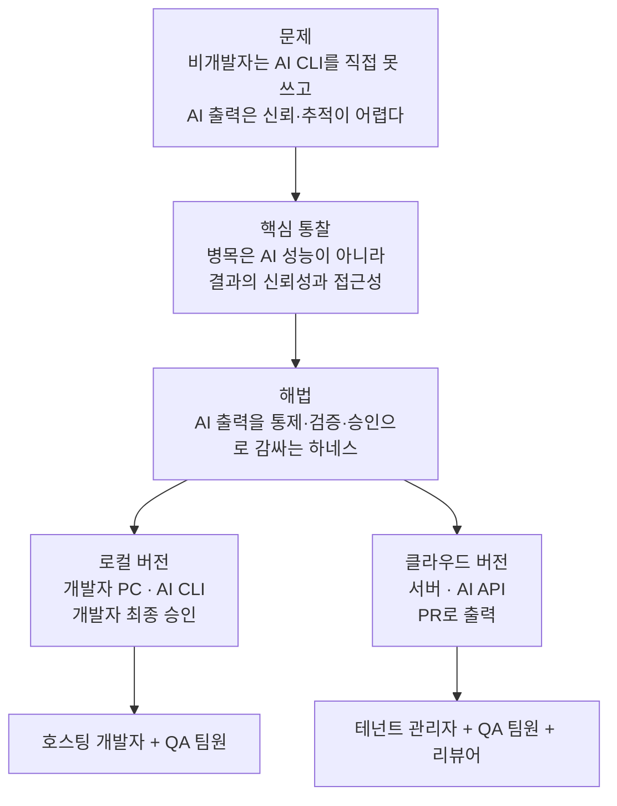

# 01. 제품 개요

제품의 비전, 문제, 타깃 사용자, 가치 제안, 범위를 정의합니다. 근거는 [`docs/research/`](../research/)에 있습니다.

## 1. 비전

개발자가 한 번 세팅해 두면, 팀의 QA·버그수정 요청이 개발자 손을 거치지 않고도 안전한 초안(로컬은 patch/branch, 클라우드는 PR)까지 도달하는 파이프라인. 비개발자가 참여하되 통제·검증·승인은 하네스와 사람이 쥔다.

## 2. 문제 정의

소규모 팀이 AI CLI로 QA·버그 수정을 빠르게 처리할 수 있게 됐지만, 팀 일상 워크플로로 만들면 다음 벽에 부딪힙니다.

- 비개발자(QA)는 터미널에서 AI CLI를 직접 쓰지 못한다. 버그를 발견한 사람과 고치는 도구 사이에 개발자가 매번 끼어야 한다.
- AI에게 무제한 권한을 주면 위험하다. 잘못된 push·deploy, secret 노출, 의도 밖 파일 수정, prompt injection.
- AI의 "고쳤다"는 자기 보고를 신뢰할 수 없다. 결과를 검증·추적·감사할 방법이 필요하다.
- 결과가 곧장 운영에 반영되면 사고가 난다. 단계적 사람 승인이 필요하다.

핵심 통찰은 [`research/00`](../research/00-verification-summary.md)·[`research/01`](../research/01-purpose-and-market-positioning.md)에서 검증됐습니다. AI 코딩 자동화의 병목은 "AI가 코드를 고칠 수 있는가"가 아니라 "그 결과를 사람이 안전하게 신뢰하고, 비개발자까지 참여시킬 수 있는가"입니다.

## 3. 시장 위치와 차별점

리서치([`research/01`](../research/01-purpose-and-market-positioning.md))에서 확인한 시장 공백입니다.

- 비개발자용 AI 앱 빌더(Lovable, v0, Bolt, Replit, GitHub Spark)는 주로 클라우드에서 신규 앱을 생성한다. 기존 코드베이스의 버그를 통제된 범위에서 고치는 흐름이 아니다.
- 자율 SWE 에이전트(Devin, Jules, Codex, Copilot cloud agent)는 기존 코드를 수정해 PR까지 만들지만, 검토 주체가 개발자임을 전제한다.
- 로컬 우선 코딩 에이전트(Cline, Aider)는 개발자 CLI/IDE 사용자를 전제한다.

"로컬 우선 또는 통제된 클라우드 + 비개발자 셀프서비스 + 기존 코드베이스 버그수정/QA + 하네스 통제"를 동시에 충족하는 제품은 확인되지 않았습니다(추정: 직접 경쟁 제품 부재). 차별점은 AI 성능이 아니라 통제·검증·접근성입니다.

## 4. 타깃 사용자

| 페르소나 | 버전 | 역할 | 필요 역량 |
|----------|------|------|-----------|
| 호스팅 개발자(PC 관리자) | 로컬 | 서버 실행, 프로젝트 등록, AI CLI 설치·인증, 최종 승인 | Git · 터미널 · AI CLI |
| 테넌트 관리자 | 클라우드 | 워크스페이스 설정, git 연동(App 설치/토큰), 프로젝트 등록 | Git · 저장소 관리 권한 |
| QA 팀원(비개발자) | 공통 | 요청 생성, 결과 확인, 1차 확인(승인/반려) | 브라우저 사용 |
| 코드 리뷰어 | 클라우드 | 생성된 PR 리뷰·머지 | 해당 저장소 리뷰 권한 |

설계상 핵심 분리는 두 버전 모두 동일합니다. 프로젝트·정책·범위 설정은 개발자(또는 테넌트 관리자)가 하고, QA는 등록된 프로젝트를 선택해 요청만 합니다. 비개발자에게 설정 부담을 지우지 않습니다.

## 5. 가치 제안

- 비개발자 참여: QA가 브라우저만으로 버그수정·QA 초안을 요청하고 결과를 확인한다.
- 통제된 AI: AI는 격리 환경에서 승인된 범위 안에서만 작업하고, 위반 시 자동 중단된다.
- 결정론적 검증: AI 자기 보고 대신 하네스가 직접 게이트(테스트·빌드·보안 스캔)를 실행해 판정한다.
- 안전한 출력: 로컬은 개발자 최종 승인, 클라우드는 팀 PR 리뷰를 거쳐야 결과가 반영된다. 자동 머지·자동 배포는 없다.
- 감사 가능성: 모든 run의 입력·계획·검증·승인·결과가 추적 가능하게 남는다.

## 6. 범위 (이번 기획 대상)

- 로컬 버전: AI CLI 기반, 비개발자 확인 → 개발자 최종 승인 → patch/branch 출력.
- 클라우드 버전: AI API 기반, 비개발자 확인 → GitHub/GitLab PR 생성 → 팀 리뷰.
- 두 버전 공통: 결정론적 검증·보안 게이트, prompt injection 방어, 단계적 승인, 감사 artifact.

이 세 가지는 이번 기획서의 고정 기준입니다. 특히 로컬의 최종 승인자는 호스팅 개발자(PC 관리자)이고, 클라우드의 제품 출력은 PR/MR 생성입니다. 클라우드에서 PR/MR이 생성된 뒤의 머지 여부는 고객 팀의 기존 리뷰·보호 규칙이 결정합니다.

## 7. 비범위 (의도적 제외)

- AI에 의한 자동 머지·자동 production 배포.
- 사람 승인을 건너뛰는 완전 무인 파이프라인.
- AI가 보안 설정·CI 정의 파일을 자율 수정하는 것(차단 대상).
- semantic code index / 임베딩 검색.
- 다국어 UI(초기 한국어 단일, 추정: 추후 확장).
- 로컬 버전의 멀티테넌시·RBAC(클라우드 버전의 영역).

## 8. 두 버전의 관계

두 버전은 동일한 통제·검증·승인 모델을 공유하되 실행 환경과 최종 승인 주체가 다릅니다. 권장 설계는 검증·승인·정책 로직을 공통 코어로 두고, 실행 백엔드(로컬 workspace ↔ 원격 샌드박스)와 출력 어댑터(로컬 발행 ↔ PR 생성)를 교체 가능한 인터페이스로 분리하는 것입니다(근거: [`research/04`](../research/04-cloud-evolution-architecture.md) 0단계 추상화). 로컬을 먼저 안정화하고 클라우드로 확장하는 진화 경로를 전제합니다.

구현 계획은 단일 제품의 두 배포 모드로 전제합니다. 이 결정을 바꾸면 실행 백엔드·출력 어댑터·권한 모델을 별도 제품 기준으로 다시 나눠야 합니다.
