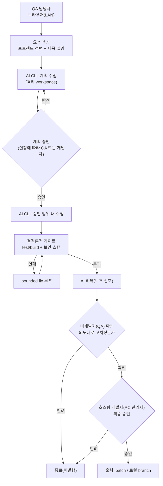

# 02. 로컬 버전

로컬 버전은 호스팅 개발자의 PC에서 AI CLI로 동작합니다. 비개발자(QA)가 1차로 확인하고, PC를 소유한 개발자가 최종 승인해야 결과가 나갑니다.

## 1. 대상과 전제

- 호스팅 개발자가 자신의 PC에서 서버를 실행하고, 같은 LAN의 QA 팀원이 브라우저로 접속한다.
- AI는 로컬에 설치된 AI CLI(Claude Code, Codex 등)를 subprocess로 호출한다. 저장소 코드와 데이터는 PC(LAN)를 벗어나지 않는다.
- 한 번에 하나의 run만 실행한다(단일 active run). 추가 요청은 대기한다.

## 2. 2단계 승인 모델

로컬 버전의 핵심은 비개발자 확인과 개발자 최종 승인을 분리한 2단계 게이트입니다.

| 단계 | 주체 | 확인하는 것 | 결과 |
|------|------|-------------|------|
| 1차 확인 | QA 담당자(비개발자) | 요청 의도대로 고쳐졌는가, QA 관점에서 문제 없는가(미리보기·검증 결과 확인) | 확인 / 반려 |
| 최종 승인 | 호스팅 개발자(PC 관리자) | 코드·보안 관점에서 발행해도 되는가 | 승인 / 반려 |

- 비개발자의 1차 확인은 "발행해도 좋다"는 판단이 아니라 "QA 의도에 맞다"는 확인입니다. 발행 권한은 개발자에게 있습니다.
- 두 단계 모두 통과해야만 출력이 생성됩니다. 어느 단계든 반려하면 run은 발행 없이 종료됩니다.
- 계획(Plan)은 QA가 이해할 수 있는 자연어로 먼저 확인합니다. 위험도가 높거나 승인 범위가 넓은 계획은 개발자 확인을 요구합니다(상세 위험도 분류는 [04 문서](./04-validation-and-security.md)).

구현 기본값은 "QA가 이해 가능한 계획을 먼저 확인하고, 위험도가 높은 계획은 개발자 확인으로 올린다"입니다. 단, 출력은 항상 개발자 최종 승인 뒤에만 생성합니다.

## 3. 사용자 흐름

1. QA가 LAN 주소로 접속한다(공유 토큰 인증).
2. 등록된 프로젝트를 드롭다운에서 선택하고, 제목·설명으로 요청을 만든다.
3. 하네스가 격리 workspace를 만들고 AI CLI로 계획(Plan)을 수립한다.
4. 계획을 검토한다. 기본은 QA 확인이며, 위험도가 높은 계획은 개발자 확인을 요구한다.
5. AI CLI가 승인된 범위 안에서만 수정한다. 범위를 벗어나면 자동 중단된다.
6. 하네스가 결정론적 게이트(테스트·빌드·보안 스캔)를 실행한다. 실패하면 제한된 횟수로 자동 수정 후 재실행한다.
7. AI 리뷰가 보조 신호로 코멘트·리스크를 남긴다(차단 권한 없음).
8. QA가 결과를 1차 확인한다(미리보기·변경 요약·검증 결과 열람 후 확인/반려).
9. 호스팅 개발자가 최종 승인한다.
10. 출력(patch 또는 로컬 branch)이 생성되고 run이 종료된다. 전 과정이 artifact로 남는다.

## 4. 출력 형태

개발자 최종 승인 후 출력은 다음 중 프로젝트가 명시적으로 선택한 방식으로만 나갑니다.

- patch 파일 생성(가장 보수적, 기본값 권장).
- 격리 workspace에서 로컬 branch commit(원격 push 없음).

원격 push·배포는 로컬 버전의 기본 범위에서 제외합니다. 로컬 버전은 "개발자 PC에서 결과 초안을 안전하게 만드는 도구"이며, 원격 협업 출력은 클라우드 버전의 PR/MR 흐름으로 분리합니다.

구현 기본값은 patch와 로컬 branch입니다. 원격 push·배포는 로컬 기본 범위에서 제외하고, 클라우드 PR/MR 흐름으로 분리합니다.

## 5. 화면 (웹 UI)

- 요청 목록: 진행 중·완료된 run 목록과 상태.
- 요청 생성: 프로젝트 선택, 제목·설명 입력.
- 요청 상세: 계획, 검증 결과, AI 리뷰, 변경 요약, 미리보기, 승인 이력. 단계별로 필요한 산출물을 인라인으로 보여준다.
- 승인 액션: 1차 확인(QA), 최종 승인(개발자)을 명확히 구분한 버튼과 코멘트.
- 설정: 서버 바인드 주소, QA 접속 URL, 등록된 프로젝트, AI CLI 설정 상태.

비개발자 UX 원칙: 전문 용어(branch, mode 등)는 설명·기본값으로 숨기고, QA에게는 "무엇을 왜 바꿨는지"의 자연어 요약과 검증 결과를 우선 보여줍니다(근거: [`research/01`](../research/01-purpose-and-market-positioning.md), [`research/02`](../research/02-agentic-coding-architecture.md)).

## 6. 기능 요구사항

- FR-L1 프로젝트 등록: 개발자가 저장소·명령·AI 역할·정책·출력 방식을 선언하고 등록한다. 등록 시 강하게 검증한다(안전한 git ref, inline secret 거부 등).
- FR-L2 요청 수명주기: 요청 생성 → 계획 → 실행 → 검증 → 1차 확인 → 최종 승인 → 출력의 단계를 관리하고, 모든 종료를 추적 가능한 terminal 상태로 닫는다.
- FR-L3 격리 실행: run마다 독립 workspace에서 작업하고, sanitized env로 AI CLI·게이트를 실행한다. workspace 밖 변경을 감지하면 자동 중단한다.
- FR-L4 계획 확인: QA가 계획을 이해하고 확인할 수 있게 하며, 위험한 변경은 개발자 확인으로 올린다.
- FR-L5 결정론적 게이트 + 보안 스캔: 하네스가 직접 게이트를 실행하고, 보안 스캔(secret/SAST/SCA)을 게이트로 편입한다(상세 [04 문서](./04-validation-and-security.md)).
- FR-L6 2단계 승인: 비개발자 1차 확인과 개발자 최종 승인을 분리해 강제한다.
- FR-L7 보수적 출력: patch/로컬 branch를 기본으로 하고, 사람 승인 없이 출력이 나가지 않는다.
- FR-L8 감사 추적: 요청·계획·검증·승인·결과를 artifact로 남기고 secret을 redaction한다.
- FR-L9 보안 가드: 공유 토큰 인증, hard-deny 명령 차단, prompt injection 방어(상세 [04 문서](./04-validation-and-security.md)).

## 7. 기존 로컬 프로토타입과의 관계

저장소의 `devauto` 코드는 이 로컬 버전과 유사한 동작을 이미 일부 구현한 프로토타입입니다. 이 기획서는 그 코드를 사양으로 삼지 않고 리서치 기준으로 재정의하지만, 구현 시 참고할 수 있는 동작 레퍼런스로 둡니다. 기획과 기존 구현이 충돌하면 이 기획서를 기준선으로 갱신할 것을 권장합니다.
