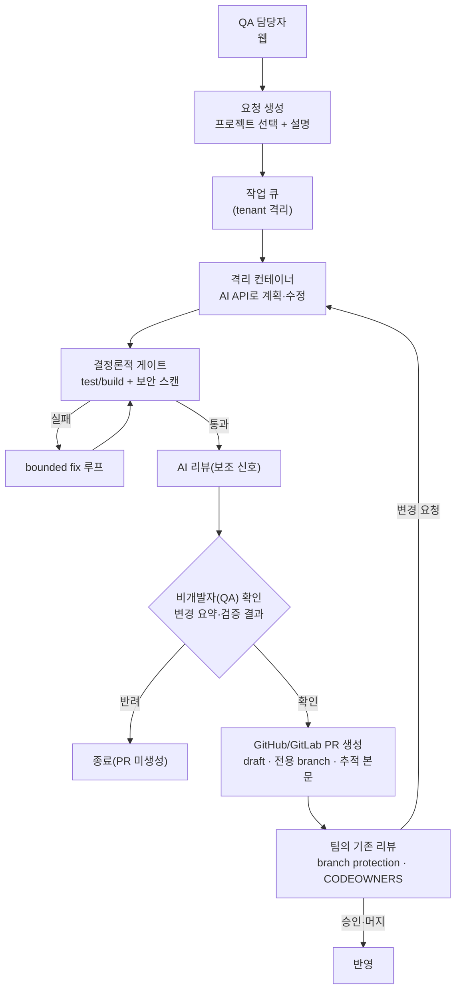

# 03. 클라우드 버전

클라우드 버전은 서버에서 AI API로 동작합니다. 비개발자(QA)가 1차로 확인하면 GitHub/GitLab에 PR(merge request)을 생성하고, 최종 승인은 팀의 기존 PR 리뷰 프로세스가 담당합니다.

## 1. 대상과 전제

- 클라우드 서버에서 여러 테넌트(팀/조직)가 동시에 사용한다.
- AI는 API(Claude/OpenAI Agent SDK 등)로 호출하고, 코드 수정은 run별 ephemeral 격리 컨테이너에서 실행한다(근거: [`research/04`](../research/04-cloud-evolution-architecture.md)).
- 최종 출력은 사람이 머지를 결정하는 PR입니다. 비개발자의 "확인"은 PR 생성 트리거일 뿐 머지 권한이 아닙니다.

## 2. 로컬 버전과의 차이

- 최종 승인 게이트가 다릅니다. 로컬은 PC 소유 개발자가 마지막 게이트지만, 클라우드는 PC 소유자가 없으므로 팀의 정상 PR 리뷰(branch protection·CODEOWNERS·required reviewers)가 최종 게이트입니다.
- 실행 엔진이 다릅니다. AI CLI subprocess가 아니라 AI API를 격리 컨테이너 안에서 호출합니다. 통제권은 여전히 하네스가 쥡니다(allowed tools·hooks·approval/permission·network policy를 하네스가 선언적으로 강제, 근거: [`research/04`](../research/04-cloud-evolution-architecture.md) 4장).
- 멀티테넌시가 필요합니다. tenant 격리, 작업 큐, 시크릿 볼트, 감사 로그가 추가됩니다.

## 3. 사용자 흐름

1. QA가 테넌트 워크스페이스에 로그인한다.
2. 등록된 프로젝트를 선택하고 요청을 만든다.
3. 요청이 작업 큐에 들어가고, ephemeral 격리 컨테이너가 할당된다.
4. AI API가 컨테이너 안에서 저장소를 클론하고 계획·수정한다. 기본 네트워크는 차단하고 필요한 대상만 허용한다.
5. 하네스가 결정론적 게이트(테스트·빌드·보안 스캔)를 실행한다. 실패하면 제한된 횟수로 자동 수정 후 재실행한다.
6. AI 리뷰가 보조 신호로 코멘트·리스크를 남긴다.
7. QA가 변경 요약·검증 결과를 보고 1차 확인한다(확인/반려).
8. 확인되면 전용 branch로 push하고 GitHub/GitLab에 draft PR을 생성한다.
9. 팀의 리뷰어가 PR을 검토·머지한다. 변경 요청이 오면 후속 작업으로 반영한다.

## 4. git 연동과 PR 생성

근거는 클라우드 git 연동 리서치([`research/04`](../research/04-cloud-evolution-architecture.md) 및 추가 조사)입니다.

### 4.1 인증·권한 모델

| 플랫폼 | 권장 모델 | 최소 권한 |
|--------|-----------|-----------|
| GitHub | GitHub App 설치형(설치별 단기 토큰) | 코드 쓰기, PR 작성, 메타데이터 읽기에 필요한 최소 권한. 워크플로 수정 권한은 부여하지 않음 |
| GitLab | 그룹/프로젝트 access token 또는 설치형 연동 | 저장소 쓰기와 MR 작성에 필요한 최소 권한, 최소 Developer 수준 |

- GitHub App 설치형은 테넌트(고객 조직)별 설치 단위로 권한이 격리되고, 사용자 계정·시트에 묶이지 않으므로 멀티테넌트 SaaS에 적합합니다. fine-grained PAT는 다중 조직을 동시에 다루기 어려워 기본값으로 부적합합니다.
- 두 플랫폼의 연동 모델이 비대칭이므로(설치형 vs 토큰), 토큰 발급·캐싱·갱신 로직을 플랫폼별 어댑터로 분리해야 합니다.
- 공식 문서 기준 GitHub App installation token은 단기 토큰이고, PR 생성에는 PR 쓰기 권한이 필요합니다. GitLab project/group access token은 해당 project/group 범위에 묶입니다. 세부 권한명은 구현 직전에 [GitHub App 인증](https://docs.github.com/en/apps/creating-github-apps/authenticating-with-a-github-app/authenticating-as-a-github-app-installation), [GitHub PR 생성](https://docs.github.com/en/rest/pulls/pulls?apiVersion=2022-11-28#create-a-pull-request), [GitLab project access token](https://docs.gitlab.com/user/project/settings/project_access_tokens/), [GitLab group access token](https://docs.gitlab.com/user/group/settings/group_access_tokens/) 문서로 재확인합니다.

### 4.2 PR/MR 생성 추상화

- 흐름은 공통입니다. 격리 컨테이너에서 클론 → 전용 branch 생성 → 커밋 → push → PR/MR 생성 API 호출.
- 플랫폼 차이는 PR/MR 생성 어댑터에서 흡수합니다. 어댑터는 draft 표현, source/base branch 표현, 본문·라벨·리뷰어 지정, self-hosted GitLab URL 차이를 숨깁니다.

### 4.3 봇 PR 거버넌스

- 모든 자동 PR은 draft로 생성하고, 식별 가능한 branch 접두사와 AI 생성 라벨을 붙인다.
- 사람 리뷰 강제는 SaaS 옵션이 아니라 고객 저장소의 branch protection·CODEOWNERS·required reviews에 의존하게 설계한다. 봇을 bypass actor로 넣지 않는다. PR 작성자(봇)는 자기 PR을 승인할 수 없으므로 구조적으로 사람 승인이 강제된다.
- auto-merge는 기본 비활성이며 지원하지 않는다(근거: [`research/03`](../research/03-pr-validation-and-security.md) 자동 머지 금지).
- 커밋 committer는 SaaS bot 계정으로 두되 PR 본문·커밋에 AI·모델·세션을 투명하게 표기한다. 표기를 임의로 숨기지 않는다.

### 4.4 추적 가능한 PR 본문

PR 본문에 다음을 채워 리뷰어가 맥락 없이 봇 PR을 받는 부담을 줄입니다.

- 원 요청(이슈/티켓 링크), 에이전트 계획·접근.
- 변경 요약(무엇을 왜 바꿨는지)과 변경 파일 목록.
- 실행·테스트·보안 스캔 결과.
- AI 모델·세션 ID, 비개발자 "확인" 메타데이터(누가 언제 확인).
- 알려진 한계·주의사항.

비개발자 화면에는 raw diff 대신 변경 파일·자연어 요약·검증 결과를 보여줍니다(근거: 추가 git 연동 리서치, 추정 포함).

## 5. 멀티테넌시와 인프라

근거: [`research/04`](../research/04-cloud-evolution-architecture.md).

- 컴퓨트 격리: run마다 ephemeral 격리 컨테이너를 생성·파기하고 egress를 통제한다. 관리형 샌드박스(E2B·Daytona·Modal 등)부터 채택하고, 적대적·신뢰 불가 코드 비중이 커지면 microVM(Firecracker/Kata) 자가호스팅을 검토한다(추정: 볼륨이 정당화될 때).
- 상태 저장: Postgres 기반 tenant 격리 모델. 모든 상태와 작업 페이로드가 tenant 정보를 필수로 갖게 해 백그라운드 작업의 테넌트 누수를 막는다.
- 작업 큐: Postgres 기반 큐로 시작하고, 내구성·재시도·타임아웃 요구가 늘면 durable orchestration을 검토한다.
- 비밀 관리: 작업마다 단명·최소권한 토큰을 발급하고, 빌드 이미지에 시크릿을 굽지 않고 런타임 주입한다. 테넌트별 시크릿 볼트, 감사 로그.
- 네트워크: 기본 전체 차단 → 필요한 대상만 허용. 에이전트 네트워크를 프로덕션·데이터스토어와 분리한다.

## 6. 기능 요구사항

- FR-C1 테넌트·프로젝트 관리: 테넌트 관리자가 워크스페이스를 설정하고 git 연동(App 설치/토큰)과 프로젝트를 등록한다.
- FR-C2 요청 수명주기: 요청 → 큐 → 격리 실행 → 검증 → 1차 확인 → PR 생성의 단계를 tenant별로 관리한다.
- FR-C3 격리 실행(API): AI API를 격리 컨테이너에서 호출하고, 하네스가 도구·승인·네트워크 정책을 선언적으로 통제한다.
- FR-C4 결정론적 게이트 + 보안 스캔: 로컬과 동일한 검증을 컨테이너 안에서 실행한다(상세 [04 문서](./04-validation-and-security.md)).
- FR-C5 비개발자 1차 확인: QA가 변경 요약·검증 결과를 확인하면 PR 생성을 트리거한다.
- FR-C6 PR/MR 생성: GitHub/GitLab 어댑터로 draft PR을 생성하고 추적 본문을 채운다. 최종 승인은 팀 리뷰에 위임한다.
- FR-C7 멀티테넌시: tenant 격리, 작업 큐, 시크릿 볼트, 감사 로그.
- FR-C8 보안 가드: egress 통제, hard-deny, prompt injection 방어, 보안 설정 파일 자율 수정 차단(상세 [04 문서](./04-validation-and-security.md)).

## 7. 구현 결정 게이트

구현 계획은 [`docs/report.md`](../report.md)의 기본 결정을 따릅니다. 아래 항목을 바꾸면 클라우드 범위와 일정이 달라집니다.

- 멀티테넌시 범위: 기본값은 외부 고객도 수용 가능한 SaaS 수준입니다.
- Git 플랫폼: 목표는 GitHub와 GitLab 모두이며, 구현 순서는 별도 일정으로 나눌 수 있습니다.
- QA 미리보기: 기본값은 PR/MR 본문 요약과 검증 결과이며, 실행 미리보기는 후속 기능입니다.
- 프로젝트 등록: 기본값은 테넌트 관리자 등록, QA 선택 전용입니다.
