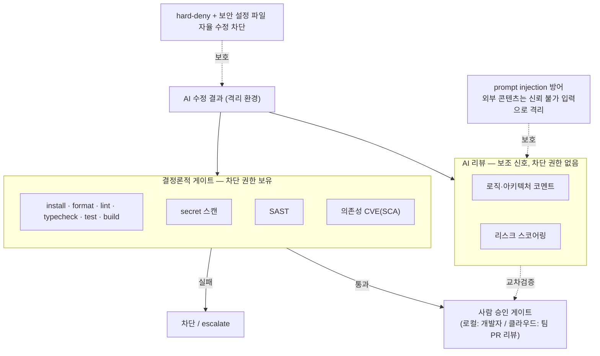

# 04. 검증과 보안 (공통)

두 버전이 공유하는 검증·보안 게이트, 권한 모델, prompt injection 방어를 정의합니다. 근거는 [`research/03`](../research/03-pr-validation-and-security.md), [`research/00`](../research/00-verification-summary.md)입니다.

## 1. 검증 원칙

- 차단 권한은 결정론적 게이트에만 둔다. AI 리뷰는 보조 신호이며 통과/차단을 결정하지 않는다(근거: [`research/03`](../research/03-pr-validation-and-security.md), AI 리뷰 도구는 놓침과 오탐이 모두 있음).
- 게이트 실행 순서와 실패 판정은 하네스가 소유한다. AI의 지시(prompt-driven validation)에 맡기지 않는다.
- AI 자기 보고를 신뢰하지 않는다. "고쳤다"는 말이 아니라 게이트 통과로 판정한다.

## 2. 결정론적 게이트

하네스가 고정 순서로 직접 실행합니다.

1. install → format → lint → typecheck → test → build (기능 검증).
2. secret 스캔: 커밋·diff 단계에서 빠른 차단(예: gitleaks류). 전체 히스토리·활성 자격증명 검증은 별도 스케줄로(예: TruffleHog verified류).
3. SAST: 패턴/데이터플로 기반 취약점 검사(예: Semgrep 또는 CodeQL류).
4. 의존성 CVE 스캔(SCA): 알려진 취약 의존성 검사(예: Dependabot/Snyk OSS류).

- 어느 게이트든 실패하면 차단하고, 제한된 횟수 안에서 자동 수정(bounded fix)을 시도한다.
- 자동 수정 루프의 각 사이클 끝에 secret·SAST 스캔을 재실행해 신규 취약점 도입을 검사한다. 새 보안 발견이 있으면 루프를 중단하고 escalate한다(근거: 반복 생성 시 취약점 누적 경향, [`research/03`](../research/03-pr-validation-and-security.md)).

구현 기본값은 secret, SAST, SCA 범주를 모두 게이트 후보로 두는 것입니다. 구체 도구는 실행 환경과 저장소 언어에 맞춰 선택합니다.

## 3. AI 생성 코드의 보안 리스크 대응

AI가 만든 코드를 AI가 리뷰하는 구조가 되기 쉬우므로, 결정론적 보안 게이트로 보강합니다(근거: [`research/03`](../research/03-pr-validation-and-security.md)).

- AI 생성 코드는 상당 비율이 보안 취약점을 포함한다는 연구가 있다(Veracode 2025 등, 방향성 참고). 기능적으로 동작해도 보안성은 별도로 검증해야 한다.
- AI 생성 코드가 공통으로 누락하는 클래스(CSRF·보안 헤더·SSRF·하드코딩 시크릿)는 결정론적 룰로 잡기 쉬운 영역이다.
- AI 보조 커밋의 시크릿 노출 비율이 더 높다는 2차 집계가 있어, secret 스캔을 필수 게이트로 둔다.

## 4. AI 리뷰 (보조 신호)

- AI 리뷰는 로직·아키텍처 코멘트와 리스크 스코어링을 제공한다. `pass/fix/escalate` 같은 신호를 낼 수 있으나 머지·발행 권한은 없다.
- 보안 관련 발견은 결정론적 스캐너 결과와 교차검증한다.
- 반복 false positive를 줄이기 위해 룰별 과거 판정·프로젝트 컨텍스트를 누적하는 노이즈 억제 계층을 둔다(근거: Semgrep Assistant식 노이즈 필터, [`research/03`](../research/03-pr-validation-and-security.md)).
- AI가 못 잡는 영역(비즈니스 로직, 아키텍처 적합성, 논리적 인가 결함)이 있으므로 크리티컬 경로는 사람 승인을 유지한다.

## 5. prompt injection 방어

AI 컨텍스트에 PR 본문·이슈·코드 주석 같은 외부 콘텐츠를 넣는 순간 공격면이 생깁니다(근거: CVE-2025-53773, [`research/03`](../research/03-pr-validation-and-security.md)).

- 외부 콘텐츠(이슈·PR 본문·외부 코드·주석)는 신뢰 불가 입력으로 취급한다. LLM 컨텍스트에 넣을 때 데이터/지시 경계를 명시한다.
- 모델 출력이 시스템 설정 변경·명령 실행·자동 승인 토글을 지시해도 무시하도록 설계한다.
- 에이전트가 자신의 승인/도구 실행 환경을 바꾸지 못하게 한다. 보안·승인·자동실행 설정 파일(`.vscode/settings.json`, CI 워크플로 정의, hook 등)을 자율 수정하면 escalate한다. CVE-2025-53773의 핵심 교훈은 "에이전트가 자신의 실행 환경을 바꿀 수 있으면 권한 상승이 된다"는 점이다.

## 6. 권한·명령 모델

- 최소 권한: AI 역할별로 권한을 차등한다. 계획·리뷰 역할은 쓰기 권한 0, 실행 역할만 승인된 범위 내 쓰기.
- hard-deny: push·deploy·sudo·파괴적 정리·SSH 등 위험 명령은 프로젝트 정책이 덮어써도 항상 차단한다. 명령 비교는 공백 변형도 같은 명령으로 취급한다.
- 범위 강제: 승인된 계획의 변경 대상 파일 범위를 벗어나면 자동 중단(escalate)한다.
- secret 위생: 모든 child process를 토큰·시크릿류 환경변수를 제거한 sanitized env로 실행하고, artifact 저장 전 redaction한다. 프로젝트 설정에 inline credential 저장을 거부한다.
- 자동 머지·자동 배포 금지: 사람 승인 없이 결과가 반영되지 않는다.

## 7. 버전별 최종 승인 게이트 매핑

| 게이트 | 로컬 버전 | 클라우드 버전 |
|--------|-----------|---------------|
| 결정론적 게이트 | 하네스가 PC에서 실행 | 하네스가 격리 컨테이너에서 실행 |
| AI 리뷰(보조) | 동일 | 동일 |
| 1차 확인 | QA 담당자 | QA 담당자 |
| 최종 승인 | 호스팅 개발자(PC 관리자) | 팀 PR 리뷰(branch protection·CODEOWNERS) |
| 출력 | patch / 로컬 branch | draft PR(머지는 팀이 결정) |

두 버전 모두 결정론적 게이트 통과 + 사람 최종 승인을 거쳐야 결과가 나간다는 원칙은 동일합니다. 차이는 최종 승인 주체가 PC 소유 개발자냐 팀의 PR 리뷰냐입니다.
