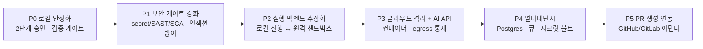

# 05. 로드맵

로컬 버전을 먼저 안정화하고 클라우드 버전으로 확장하는 단계적 경로입니다. 근거는 [`research/04`](../research/04-cloud-evolution-architecture.md)의 0~3단계 진화 모델입니다.

## 1. 단계별 계획

| 단계 | 테마 | 핵심 항목 | 버전 |
|------|------|-----------|------|
| P0 | 로컬 안정화 | 비개발자 확인 + 개발자 최종 승인의 2단계 게이트, 결정론적 게이트, 격리 workspace, 비개발자 onboarding 문서·실사용 YAML 예시 | 로컬 |
| P1 | 보안 게이트 강화 | secret·SAST·SCA를 게이트로 편입, prompt injection 방어, hard-deny 확장(보안 설정 파일 자율 수정 차단), fix 루프 보안 회귀 검사 | 로컬(→공통) |
| P2 | 실행 백엔드 추상화 | 실행 백엔드와 출력 어댑터를 분리(로컬 실행 ↔ 원격 샌드박스, 로컬 발행 ↔ PR 생성) | 공통 기반 |
| P3 | 클라우드 격리 + AI API | 관리형 샌드박스에서 AI API 호출, egress 통제, 하네스가 도구·승인·네트워크 정책 선언적 통제 | 클라우드 |
| P4 | 멀티테넌시 | Postgres 기반 tenant 격리, 작업 큐, 테넌트별 시크릿 볼트, 감사 로그, 인증/RBAC | 클라우드 |
| P5 | PR 생성 연동 | GitHub App 설치형 + GitLab 토큰, draft PR·전용 branch·추적 본문, branch protection에 최종 승인 위임 | 클라우드 |

순서의 근거: 보안 게이트(P1)는 두 버전 공통 자산이므로 클라우드보다 먼저 확보합니다. 실행 백엔드 추상화(P2)를 클라우드 도입(P3) 전에 두어, 한 번에 재작성하지 않고 점진적으로 이전합니다.

## 2. 마일스톤 정의

- M1(P0 완료): 비개발자가 개발자 호출 없이 요청→1차 확인까지 끝내고, 개발자 최종 승인으로 patch가 생성된다.
- M2(P1 완료): secret/SAST/SCA 게이트가 required check로 동작하고, 보안 설정 파일 자율 수정이 차단된다.
- M3(P2 완료): 동일 검증·승인 코어가 로컬·원격 실행 백엔드를 모두 구동할 수 있다(인터페이스 분리 완료).
- M4(P3-P4 완료): 멀티테넌트 환경에서 격리 컨테이너로 AI API 실행이 동작하고 tenant가 격리된다.
- M5(P5 완료): 비개발자 확인이 GitHub/GitLab draft PR을 생성하고, 팀 리뷰로 머지된다.

## 3. 성공 지표 (제안)

코드에 측정 로직은 아직 없으므로 제품 목표에서 역산한 제안입니다(추정).

- 자율 처리율: 개발자/리뷰어 개입 전까지 도달한 비율(로컬 patch, 클라우드 PR 생성).
- QA 셀프서비스 완결률: QA가 개발자 호출 없이 1차 확인까지 끝낸 비율.
- 안전 차단 정확도: escalate 중 올바르게 막은 비율(오탐/미탐).
- 보안 게이트 검출: 발행/PR 전에 차단한 secret·취약점 건수.
- 재작업률: 발행·머지 후 사람이 되돌린 비율.
- 평균 처리 시간: 요청 생성 → terminal까지.

## 4. 리스크

- 비개발자 UX 격차: 전문 용어·승인 흐름이 비개발자에게 불친절하면 G1(셀프서비스)이 흔들린다. 자연어 요약·기본값 숨김으로 완화(근거: [`research/01`](../research/01-purpose-and-market-positioning.md)).
- AI 생성 코드 보안: AI 코드의 취약 경향 때문에 검증 없는 발행은 위험하다. P1 보안 게이트를 선행(근거: [`research/03`](../research/03-pr-validation-and-security.md)).
- prompt injection: 외부 콘텐츠를 컨텍스트로 쓰는 경로가 공격면이다. 신뢰 불가 입력 격리·설정 파일 자율 수정 차단으로 완화.
- 클라우드 격리 비용: 강한 격리(microVM)는 콜드스타트·데이터 이동 비용이 크다. 관리형 샌드박스로 시작하고 볼륨이 정당화될 때 자가호스팅 검토.
- 승인자 식별: 단일 공유 토큰은 누가 승인했는지 식별이 어렵다. 클라우드는 인증/RBAC로, 로컬은 경량 식별로 보완(추정).
- 두 버전 분기 비용: 로컬·클라우드가 분리되면 유지보수가 두 배가 된다. P2 공통 코어 추상화로 완화.

## 5. 현재 상태와의 관계

저장소의 `devauto` 프로토타입은 P0의 상당 부분(2단계 승인·격리·결정론적 게이트·웹 UI)에 대응하는 동작을 이미 일부 구현하고 있습니다. 다만 이 기획은 코드를 사양으로 삼지 않으므로, P0은 "기존 동작을 이 기획 기준으로 재정렬하고 비개발자 onboarding·실사용 예시를 채우는 것"으로 정의합니다. P1 이후가 새로 설계·구현할 핵심 영역입니다.
