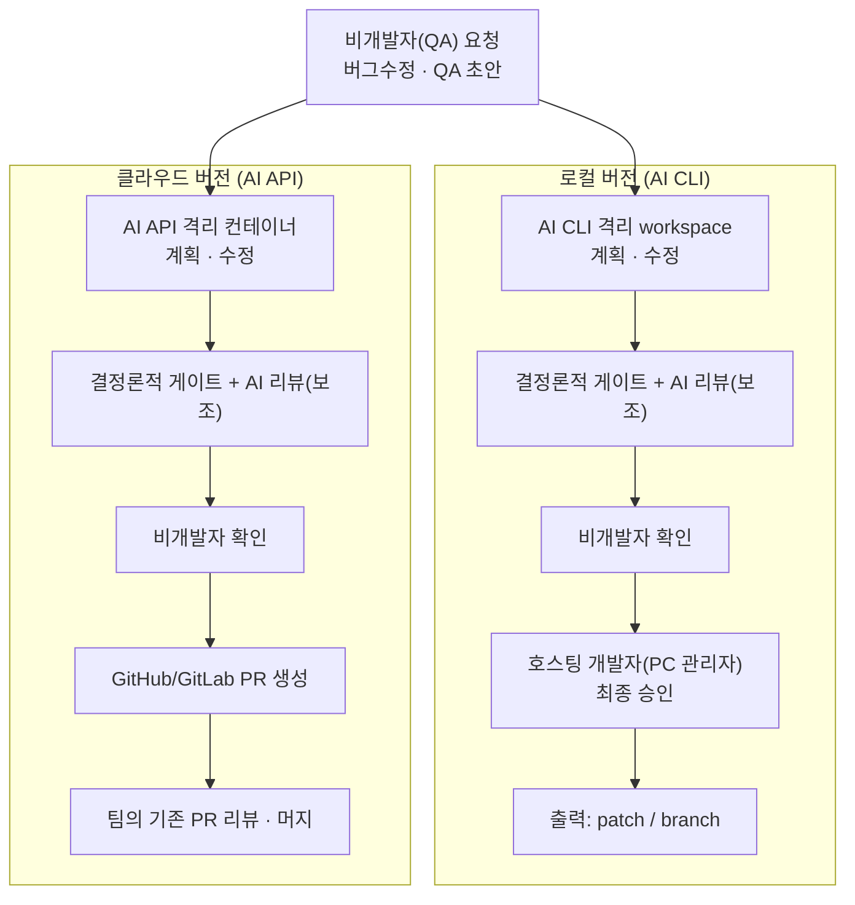

# AI Debug 기획서

이 디렉터리는 [`docs/research/`](../research/)의 조사 결과를 기반으로 작성한 제품 기획서입니다. 저장소에 이미 구현된 코드(`devauto`)는 명확한 기획 없이 만들어졌으므로 참고만 하고, 이 기획서는 리서치에서 검증된 의도를 기준으로 제품을 다시 정의합니다.

제품은 두 가지 버전으로 명확히 구분합니다. 로컬 버전은 개인 PC에서 AI CLI로 동작하고 호스팅 개발자가 최종 승인합니다. 클라우드 버전은 서버에서 AI API로 동작하고 결과를 GitHub/GitLab PR로 내보냅니다.

## 0. 요약

## 1. 한 줄 정의

비개발자(QA) 팀원이 AI에게 버그수정·QA 초안을 안전하게 맡기고, 하네스가 범위·권한·검증을 통제하며, 사람이 단계적으로 승인해 결과를 내보내는 도구. AI는 자율 주체가 아니라 하네스가 통제하는 역할별 도구다.

## 2. 두 버전의 핵심 구분

| 구분 | 로컬 버전 | 클라우드 버전 |
|------|-----------|---------------|
| 실행 위치 | 호스팅 개발자의 PC(LAN) | 클라우드 서버(멀티테넌트) |
| AI 호출 | AI CLI(Claude Code, Codex 등) subprocess | AI API(Agent SDK 등) |
| 격리 | run별 로컬 git workspace + sanitized env | run별 ephemeral 격리 컨테이너 + egress 통제 |
| 1차 확인 | 비개발자(QA) 확인 | 비개발자(QA) 확인 |
| 최종 승인 | 호스팅 개발자(PC 관리자)의 최종 승인 | 팀의 기존 PR 리뷰·머지(branch protection) |
| 출력 | patch / 로컬 branch (개발자 승인 후) | GitHub/GitLab PR(merge request) |
| 상태 저장 | SQLite 단일 파일 | Postgres(tenant 격리) |
| 동시성 | 단일 active run | 멀티테넌트 동시 실행 |

핵심 차이는 최종 승인 모델입니다. 로컬은 PC를 소유한 개발자가 마지막 게이트이고, 클라우드는 PC 소유자가 없으므로 팀의 정상 PR 리뷰 프로세스가 최종 게이트입니다. 비개발자의 "확인"은 두 버전 모두 발행/PR 생성을 여는 트리거이지 머지 권한이 아닙니다.

## 3. 두 버전이 공유하는 원칙

- 하네스가 통제권을 쥔다. 상태 전이·승인·게이트·출력은 결정론적 코드가 통제하고 AI에게 위임하지 않는다.
- 결정론적 검증을 신뢰한다. AI의 자기 보고가 아니라 하네스가 직접 실행하는 게이트(테스트·빌드·보안 스캔)가 통과를 판정한다.
- AI 리뷰는 보조 신호다. 차단 권한은 결정론적 게이트에 있고 AI 판단에는 없다.
- 비개발자를 1차 사용자로 둔다. 개발자는 한 번 세팅하고, 비개발자는 등록된 프로젝트를 선택만 한다.
- 보수적 출력. 결과가 사람 승인 없이 운영에 자동 반영되지 않는다(자동 머지·자동 배포 금지).
- 감사 가능성. 모든 run은 요청·계획·검증·승인·결과를 추적 가능한 형태로 남긴다.
- 보안을 기본값으로. secret 위생, hard-deny 명령 차단, prompt injection 방어를 두 버전 모두에 적용한다.

## 4. 문서 안내

| 문서 | 내용 |
|------|------|
| [01 제품 개요](./01-product-overview.md) | 비전, 문제 정의, 타깃 페르소나, 가치 제안, 범위와 비범위 |
| [02 로컬 버전](./02-local-version.md) | 로컬 버전 상세: 사용자 흐름, 2단계 승인 모델, 기능 요구, 화면, 출력 |
| [03 클라우드 버전](./03-cloud-version.md) | 클라우드 버전 상세: AI API, 격리, 멀티테넌시, PR 생성, git 연동, 기능 요구 |
| [04 검증과 보안](./04-validation-and-security.md) | 두 버전 공통 검증·보안 게이트, 인젝션 방어, 권한 모델 |
| [05 로드맵](./05-roadmap.md) | 단계별 로드맵, 마일스톤, 성공 지표, 리스크 |

근거가 된 리서치는 [`docs/research/`](../research/)를 참조하세요. 구현 순서와 기본 결정은 [`docs/report.md`](../report.md)에 정리했습니다.

## 5. 기준과 한계

- 이 기획서는 리서치(2026-06 기준)를 토대로 한 제품 정의이며, 기존 구현 코드의 사양 설명이 아닙니다.
- 외부 도구·벤더 사양은 빠르게 변하므로, 구현 시점에 공식 문서로 재확인이 필요합니다. 코드 근거 없는 해석은 "추정"으로 표기했습니다.
