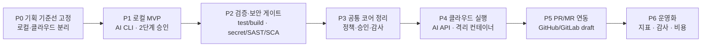

# AI Debug 구현 계획

이 문서는 [`docs/plan/`](./plan/) 기획서를 구현 가능한 작업 순서로 바꾼 실행 계획입니다. 이미 존재하는 `devauto` 구현은 참고 가능한 프로토타입일 뿐이며, 이 계획의 기준은 리서치와 기획서입니다.

기준 문서:

- 제품 정의: [`docs/plan/README.md`](./plan/README.md)
- 로컬 버전: [`docs/plan/02-local-version.md`](./plan/02-local-version.md)
- 클라우드 버전: [`docs/plan/03-cloud-version.md`](./plan/03-cloud-version.md)
- 검증과 보안: [`docs/plan/04-validation-and-security.md`](./plan/04-validation-and-security.md)
- 리서치 검증: [`docs/research/00-verification-summary.md`](./research/00-verification-summary.md)

## 0. 구현 요약

## 1. 구현 원칙

- 기존 구현을 사양으로 삼지 않습니다. 구현이 기획과 충돌하면 기획서를 기준으로 재정렬합니다.
- 로컬과 클라우드는 제품 목적은 같지만 실행 엔진과 최종 승인자가 다릅니다.
- 로컬은 AI CLI를 사용하고, QA 확인 뒤 호스팅 개발자(PC 관리자)가 최종 승인합니다.
- 클라우드는 AI API를 사용하고, QA 확인 뒤 GitHub/GitLab PR 또는 MR을 생성합니다.
- AI 리뷰는 보조 신호입니다. 발행·PR 생성 차단 권한은 결정론적 게이트와 사람 승인에 둡니다.
- 자동 머지와 자동 배포는 범위에서 제외합니다.

## 2. 기본 결정

기획 검토 중 나온 열린 항목은 아래 기본값으로 구현 계획에 흡수합니다. 기본값을 바꾸면 제품 성격이 달라지므로, 변경 시 기획서를 함께 갱신합니다.

| 영역 | 기본 결정 | 구현에 주는 의미 |
|------|-----------|------------------|
| 제품 구조 | 단일 제품의 두 배포 모드로 본다 | 검증·승인·감사 원칙은 공통화하고, 실행 엔진과 출력 방식은 분리한다 |
| 우선순위 | 로컬 안정화 → 보안 게이트 → 클라우드 확장 | 클라우드 기능을 먼저 만들지 않는다 |
| 로컬 계획 승인 | QA가 이해 가능한 계획을 확인하되, 위험도가 높으면 개발자 확인으로 올린다 | QA UX와 위험도 분류가 P1/P2의 핵심이다 |
| 로컬 출력 | patch와 로컬 branch를 기본 출력으로 둔다 | 원격 push·배포는 로컬 기본 범위에서 제외한다 |
| 로컬 승인자 | 단일 PC 관리자를 기본 승인자로 둔다 | 다중 승인자는 후속 운영 확장으로 둔다 |
| 로컬 식별 | 가벼운 승인자 식별만 우선한다 | 강한 RBAC는 클라우드 영역으로 둔다 |
| 클라우드 테넌시 | 외부 고객도 수용 가능한 멀티테넌시를 목표로 한다 | tenant 격리, 시크릿 볼트, 감사 로그를 초기 설계에 포함한다 |
| 클라우드 최종 승인 | PR/MR 생성 후 팀의 기존 리뷰가 최종 게이트다 | 별도 PC 관리자 모델을 클라우드에 복제하지 않는다 |
| Git 플랫폼 | GitHub와 GitLab을 모두 목표에 둔다 | 구현 순서는 나눌 수 있지만 추상화는 두 플랫폼을 전제로 둔다 |
| 클라우드 미리보기 | PR/MR 본문 요약과 검증 결과를 기본으로 한다 | 실행 미리보기는 후속 기능으로 검토한다 |
| 프로젝트 등록 | 관리자만 등록하고 QA는 선택만 한다 | 비개발자에게 저장소·토큰·명령 설정 부담을 주지 않는다 |
| AI 제공자 | 로컬은 AI CLI, 클라우드는 AI API로만 고정한다 | 특정 모델은 구현 직전 공식 문서와 비용으로 결정한다 |
| 보안 스캐너 | secret, SAST, SCA 범주를 필수 게이트 후보로 둔다 | 구체 도구는 환경별 플러그인으로 선택한다 |
| 검증 경로 | 결정론적 게이트 우선, AI 리뷰 보조 | self-review 위험은 모델 분리보다 게이트 분리로 먼저 낮춘다 |

## 3. 단계별 구현 계획

### P0. 기획 기준선 고정

목표: 구현팀이 무엇을 만들지 같은 언어로 이해하게 합니다.

작업:

- `docs/plan`을 제품 기준선으로 선언합니다.
- 기존 구현과 기획이 충돌하는 항목을 "재정렬 대상"으로 분리합니다.
- 로컬과 클라우드의 사용자, 승인자, 출력물을 한 표로 고정합니다.
- 비범위(자동 머지, 자동 배포, 무인 운영, 로컬 멀티테넌시)를 구현 backlog에서 제외합니다.

완료 기준:

- 로컬 흐름이 "QA 요청 → AI CLI 작업 → 결정론적 게이트 → QA 확인 → PC 관리자 승인 → patch/branch"로 설명됩니다.
- 클라우드 흐름이 "QA 요청 → AI API 작업 → 결정론적 게이트 → QA 확인 → GitHub/GitLab PR/MR 생성 → 팀 리뷰"로 설명됩니다.
- 기존 구현 기반 요구와 새 기획 기반 요구가 섞이지 않습니다.

### P1. 로컬 MVP 정렬

목표: 비개발자가 브라우저만으로 요청하고, PC 관리자가 안전하게 최종 승인할 수 있는 로컬 버전을 완성합니다.

작업:

- 프로젝트 등록은 개발자만 수행하고 QA는 등록된 프로젝트를 선택하게 합니다.
- QA 요청 화면은 제목, 설명, 기대 결과 중심으로 구성합니다.
- AI CLI 실행은 run별 격리 workspace와 sanitized environment에서만 허용합니다.
- 계획은 자연어 요약, 후보 변경 범위, 위험도, 검증 예정 항목을 포함해야 합니다.
- QA 확인과 PC 관리자 최종 승인을 화면·상태·감사 기록에서 분리합니다.
- 로컬 출력은 patch와 로컬 branch까지만 기본 지원합니다.

완료 기준:

- QA는 터미널·Git 지식 없이 요청 생성과 1차 확인을 끝낼 수 있습니다.
- PC 관리자는 검증 결과와 변경 요약을 보고 최종 승인 또는 반려할 수 있습니다.
- 사람 승인 전에는 patch/branch가 생성되지 않습니다.

### P2. 검증·보안 게이트 강화

목표: AI의 자기 보고가 아니라 하네스가 직접 실행한 검증 결과로 통과 여부를 판단합니다.

작업:

- 기능 게이트는 install, format, lint, typecheck, test, build 범주로 정리합니다.
- 보안 게이트는 secret scan, SAST, SCA 범주를 포함합니다.
- AI 리뷰는 로직·아키텍처 리스크를 보조 신호로만 남깁니다.
- PR/이슈/주석/외부 문서는 prompt injection 가능한 신뢰 불가 입력으로 취급합니다.
- 보안 설정, 승인 설정, CI/hook 파일의 자율 수정은 escalate 대상으로 둡니다.
- 자동 수정 루프는 횟수 제한과 보안 회귀 재검사를 포함합니다.

완료 기준:

- 기능 게이트 실패는 발행 또는 PR 생성을 차단합니다.
- secret/SAST/SCA 발견은 차단 또는 명시적 escalate로 처리됩니다.
- AI 리뷰 결과만으로 통과·차단이 결정되지 않습니다.

### P3. 공통 코어 정리

목표: 로컬과 클라우드가 같은 승인·검증·감사 원칙을 공유하게 합니다.

작업:

- 요청 수명주기, 상태 전이, 승인 기록, 게이트 결과, artifact 모델을 실행 위치와 분리합니다.
- 로컬 실행과 원격 샌드박스 실행을 같은 제품 흐름으로 설명할 수 있게 합니다.
- 로컬 발행과 PR/MR 생성을 출력 어댑터로 분리합니다.
- audit artifact는 요청, 계획, 실행, 검증, QA 확인, 최종 승인, 결과를 모두 포함하게 합니다.

완료 기준:

- 로컬 구현을 유지한 채 클라우드 실행 백엔드를 붙일 수 있는 경계가 문서와 구현에 드러납니다.
- 승인과 검증 로직이 AI CLI 또는 AI API 어느 한쪽에 종속되지 않습니다.

### P4. 클라우드 실행 기반

목표: AI API와 격리 컨테이너를 사용해 멀티테넌트 클라우드 실행을 가능하게 합니다.

작업:

- tenant, project, user, run, approval, artifact의 소유 관계를 명확히 합니다.
- run마다 ephemeral 격리 컨테이너를 생성하고 폐기합니다.
- 기본 네트워크는 차단하고 필요한 git/API 대상만 허용합니다.
- 테넌트별 시크릿 볼트와 단명 토큰 주입을 도입합니다.
- 작업 큐, 재시도, 타임아웃, 중단, 감사 로그를 tenant 경계 안에서 처리합니다.
- 클라우드 QA 화면은 실행 미리보기보다 변경 요약과 검증 결과를 우선합니다.

완료 기준:

- 한 tenant의 코드, 시크릿, artifact가 다른 tenant로 섞이지 않습니다.
- AI API 호출과 코드 수정은 격리 컨테이너 안에서만 수행됩니다.
- QA 확인 전에는 PR/MR이 생성되지 않습니다.

### P5. GitHub/GitLab PR/MR 연동

목표: QA 확인이 끝난 클라우드 run을 추적 가능한 draft PR/MR로 내보냅니다.

작업:

- GitHub는 GitHub App 설치형 권한 모델을 기본으로 검토합니다.
- GitLab은 project/group 범위 토큰 또는 설치형 연동을 검토합니다.
- PR/MR은 전용 branch, draft 상태, AI 생성 라벨, 추적 가능한 본문을 갖습니다.
- PR/MR 본문에는 원 요청, 계획, 변경 요약, 검증 결과, 보안 스캔 결과, QA 확인 정보를 포함합니다.
- 봇 계정은 branch protection, CODEOWNERS, required reviews를 우회하지 않습니다.
- auto-merge는 지원하지 않습니다.

완료 기준:

- GitHub와 GitLab 중 구현 대상 플랫폼에서 draft PR/MR이 생성됩니다.
- PR/MR 생성 뒤 머지 여부는 고객 팀의 기존 리뷰·보호 규칙이 결정합니다.
- PR/MR만 봐도 AI 작업의 근거와 검증 결과를 추적할 수 있습니다.

### P6. 운영화와 지표

목표: 제품 사용성과 안전성을 반복적으로 개선할 수 있게 합니다.

작업:

- 자율 처리율, QA 셀프서비스 완결률, 안전 차단 정확도, 보안 게이트 검출, 재작업률, 평균 처리 시간을 측정합니다.
- run 실패·반려·escalate 사유를 분류합니다.
- 승인자 식별, 감사 로그 보존, 데이터 삭제 정책을 정합니다.
- 클라우드 비용은 실행 시간, 샌드박스 리소스, AI API 사용량 기준으로 추적합니다.

완료 기준:

- 운영자가 어떤 gate가 병목인지 알 수 있습니다.
- QA와 리뷰어가 반려한 이유를 다음 실행에 반영할 수 있습니다.
- 보안·감사 요구를 제품 설정으로 설명할 수 있습니다.

## 4. 검증 계획

| 검증 대상 | 확인 방법 | 통과 기준 |
|-----------|-----------|-----------|
| 로컬 승인 흐름 | QA 확인과 PC 관리자 승인이 분리되는지 확인 | 두 승인 중 하나라도 없으면 출력 없음 |
| 클라우드 승인 흐름 | QA 확인 전 PR/MR 생성 여부 확인 | QA 확인 전에는 PR/MR 없음 |
| 결정론적 게이트 | 실패하는 테스트·빌드·보안 스캔을 넣어 확인 | 실패가 발행·PR 생성을 차단 |
| prompt injection 방어 | 이슈·PR 본문·주석에 명령형 공격 문구를 넣어 확인 | 시스템 설정 변경·자동 승인 지시 무시 |
| 범위 강제 | 승인 범위 밖 파일 변경 시도 | run 중단 또는 escalate |
| secret 위생 | 환경변수·artifact·PR 본문 노출 확인 | secret redaction 또는 차단 |
| PR/MR 거버넌스 | 봇 PR/MR의 branch protection 우회 여부 확인 | 봇이 머지·승인을 우회하지 않음 |

## 5. 리스크와 완화

| 리스크 | 영향 | 완화 |
|--------|------|------|
| QA가 계획·검증 결과를 이해하지 못함 | 비개발자 셀프서비스 실패 | 자연어 요약, 위험도 라벨, 기본값 숨김 |
| AI 생성 코드 취약점 | 보안 사고 | secret/SAST/SCA를 필수 게이트로 편입 |
| AI 리뷰 과신 | 결함 누락 또는 오탐 피로 | AI 리뷰를 보조 신호로 제한 |
| 클라우드 tenant 누수 | 심각한 보안 사고 | tenant 경계, 시크릿 볼트, 격리 컨테이너, 감사 로그 |
| PR/MR 봇 권한 과다 | 보호 규칙 우회 | 최소 권한, draft PR/MR, branch protection 위임 |
| 로컬과 클라우드 분기 | 유지보수 비용 증가 | 승인·검증·감사 코어 공통화 |

## 6. 명시적 비범위

- AI 자동 머지.
- 사람 승인 없는 production 배포.
- QA의 저장소·토큰·명령 직접 설정.
- 로컬 버전의 강한 멀티테넌시와 조직 RBAC.
- AI 리뷰 단독 보안 판정.
- semantic code index 또는 대규모 코드 검색 제품화.

## 7. 다음 실행 순서

1. `docs/plan`을 기준으로 기존 구현과의 차이 목록을 작성합니다.
2. P1 로컬 MVP에서 기획과 충돌하는 동작을 제거하거나 재정렬합니다.
3. P2 보안 게이트를 로컬에 먼저 붙입니다.
4. P3에서 공통 승인·검증·감사 경계를 잡습니다.
5. P4 이후 클라우드 AI API와 PR/MR 흐름을 추가합니다.

이 순서를 바꾸려면 클라우드 우선 사업 사유, 플랫폼 우선순위, 보안 게이트 도입 범위를 먼저 다시 결정해야 합니다.
