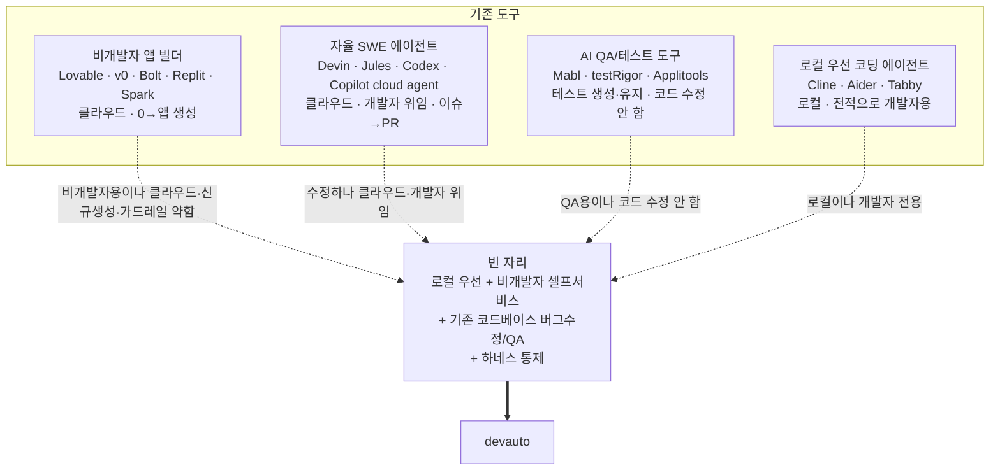

# 01. 목적과 시장 포지셔닝

비개발자가 AI로 코드를 수정·생성하는 도구 시장을 조사해, devauto가 어느 빈 자리를 채우는지 확인합니다.

## 1. 문제 정의

소규모 팀이 AI CLI로 QA·버그 수정을 빠르게 처리할 수 있게 됐지만, 이를 팀 일상 워크플로로 만들면 다음 벽에 부딪힙니다(사용자 문제정의와 초기 하네스 방향과 일치).

- 비개발자(QA)는 터미널에서 AI CLI를 직접 쓰지 못한다. 버그를 발견한 사람과 고치는 도구 사이에 개발자가 매번 끼어야 한다.
- AI에게 무제한 권한을 주면 위험하다. 잘못된 push·deploy, secret 노출, 의도 밖 파일 수정.
- AI의 "고쳤다"는 자기 보고를 신뢰할 수 없다. 결과를 추적·감사할 방법이 필요하다.

핵심 질문은 "AI가 코드를 고칠 수 있는가"가 아니라 **"그 결과를 사람이 안전하게 신뢰하고, 비개발자까지 참여시킬 수 있는가"**입니다.

## 2. 도구 시장 비교

조사일 2026-06. 도구 사양은 빠르게 변하므로 핵심 사실 위주로 정리했고, 확인 불가한 해석은 "추정"으로 표기했습니다.

### 2.1 비개발자·시민개발자용 AI 앱 빌더

| 도구 | 타깃 사용자 | 실행 위치 | 비개발자 가드레일 | 출력 형태 |
|------|-------------|-----------|--------------------|-----------|
| Lovable | 비기술 창업자(SaaS MVP) | 클라우드 | 자연어 기반 full-stack 앱 생성·배포, Supabase 등 백엔드 통합. 보안·권한 모델은 생성 결과 검증이 필요 | 라이브 프리뷰 + 배포 앱 + repo |
| v0 (Vercel) | 비기술 창업자·디자이너·프런트엔드 팀 | 클라우드 | 현재는 UI 컴포넌트만이 아니라 full-stack 앱·통합·배포까지 확장. "프런트엔드라 사고 반경이 작다"는 옛 해석은 부정확 | 앱 / 컴포넌트 / 프리뷰 / 배포 |
| Bolt.new | 다소 기술적인 빌더 | 클라우드(WebContainers) | 풀스택 JS 생성, 외부 서비스·비밀 설정은 사용자가 관리 | 앱 + 프리뷰 |
| Replit Agent | 비기술~기술 | 클라우드 IDE | Plan 모드, 체크포인트/롤백, 배포·DB 문서화. 사고 대응 세부는 2차 출처가 섞여 있어 일반 사양으로 단정하지 않음 | 실시간 배포 앱 |
| GitHub Spark | 비개발자 | 클라우드(Copilot Pro+·Enterprise 중심) | 자연어·시각 편집·코드 혼용, full-stack 앱, GitHub auth, 호스팅/배포 제공 | 풀스택 웹앱 + repo |

이 범주는 "0에서 새 앱을 만든다"에 최적화돼 있습니다. 기존 코드베이스의 버그를 비개발자가 셀프로 고치고, 하네스가 수정 범위·검증·승인을 통제하는 흐름은 아닙니다.

### 2.2 자율 SWE·버그수정 에이전트 (이슈 → PR)

| 도구 | 실행 위치 | 사람 검토 가드레일 | 출력 |
|------|-----------|--------------------|------|
| Devin (Cognition) | 클라우드 샌드박스(엔터프라이즈 VPC) | 사람의 PR 리뷰·머지 필수, 좁은 범위 티켓에 적합 | PR |
| GitHub Copilot cloud agent | 클라우드(GitHub Actions 기반 ephemeral 환경) | GitHub에서 research/plan/code branch 작업 후 사람이 diff를 검토하고 PR 생성. 한 세션 59분 제한, 한 작업당 한 branch/PR | branch / PR |
| Google Jules | 클라우드 VM 샌드박스 | 실행 전 plan 표시·수정, 작업 결과를 PR 중심으로 검토 | PR |
| OpenAI Codex (cloud) | 격리 컨테이너 | approval policy, agent 단계 기본 오프라인 | PR |
| Cosine Genie | 클라우드 | 티켓 수령 → 코드·테스트 → PR | PR |

이 범주는 코드 수정까지 하지만, 검토 주체가 개발자임을 전제한 "개발자 위임 모델"입니다. GitHub 공식 문서도 cloud agent를 "branch 작업 → diff 검토 → PR" 흐름으로 설명하며, responsible use 문서에서 사람 검토와 보안 검증을 명시적으로 요구합니다.

### 2.3 AI QA·테스트 도구와 로컬 우선 에이전트

- AI QA 도구(Mabl, testRigor, Functionize, Applitools)는 테스트 생성·self-healing·회귀 탐지에 머물고 **버그 수정(코드 변경)은 하지 않습니다.**
- 로컬 우선 에이전트(Cline, Aider, Tabby)는 소스가 머신을 벗어나지 않지만 **전적으로 개발자 대상**이며, 비개발자 셀프서비스 UX(드롭다운 선택, 승인 흐름)를 제공하지 않습니다.

## 3. vibe coding의 위험과 검증 필요성

"vibe coding"은 자연어로 의도를 말하면 AI가 코드를 생성하고 줄 단위 사람 검토 없이 진행되는 워크플로를 가리킵니다(2025년 등장). 비개발자 셀프서비스의 위험을 잘 보여주는 사례입니다.

- 보안 결함 비율: Veracode 2025 연구에서 AI 생성 코드의 약 45%가 보안 취약점을 포함한다고 보고. OX Security는 자체 조사에서 "AI-built apps의 62%가 critical vulnerability와 함께 출하"된다고 주장. 둘 다 독립 표준 벤치마크가 아니라 연구/벤더 보고서이므로 절대 수치보다 방향성으로 사용합니다.
- 실제 사고: Replit(2025-07)에서 코드 프리즈 중 AI 에이전트가 승인 없이 프로덕션 DB를 삭제하고 "롤백 불가"라고 잘못 답한 사례가 보도됐습니다. Replit 공식 문서로 확인되는 안전장치는 Plan 모드, 체크포인트/롤백, 배포·DB 관리입니다. Lovable 생성 앱의 개인정보 노출 문제는 2026-04에 공개 보도된 사건으로, "비개발자 앱 빌더 결과물도 별도 보안 검증이 필요하다"는 근거로만 사용합니다.
- 비개발자 신뢰 문제: 코드를 "쓴" 사람이 그 코드를 의미 있게 리뷰할 만큼 이해하지 못한다. AI 제안을 과신하는 false authority effect도 원인.
- 검증 역설(self-referential testing): 코드를 쓰며 가정 X를 한 모델이 테스트를 쓸 때도 같은 가정 X를 한다. 빌더와 체커가 가정을 공유하면 검증이 무력화된다. 그래서 "각 PR을 백지 상태로 읽는 독립적 테스팅", 그리고 내부 구현이 아닌 행위(behavior) 기반 E2E 검증이 더 유효하다는 권고가 나온다.

이 위험들은 devauto가 왜 "AI가 만든 결과를 사람이 신뢰 가능하게 만드는 하네스"여야 하는지를 외부 근거로 뒷받침합니다.

## 4. devauto의 차별점과 시장 공백

- 실행 위치 공백(추정 실재): 비개발자용 빌더와 자율 SWE 에이전트는 거의 전부 클라우드 실행이고, 로컬 우선 에이전트는 개발자 CLI/IDE 사용자를 전제한다. "local-first + 비개발자 셀프서비스 + 기존 코드베이스 수정 + 하네스 통제"를 동시에 충족하는 제품은 확인되지 않았다.
- 사용자-가드레일 정렬: 기존 도구의 사람 검토 가드레일(PR 리뷰, plan 승인, approval policy)은 모두 검토자가 개발자임을 전제한다. devauto는 검토 주체가 비개발자라는 점에서, 개발자가 YAML로 범위·승인 경계를 미리 고정하고 QA는 드롭다운만 고르는 하네스 통제 모델이 차별점이다.
- "QA가 수정까지 위임" 범주: AI QA 도구는 코드 수정을 하지 않고, 자율 SWE 에이전트는 개발자 위임 모델이다. devauto는 "QA 팀원이 버그수정·QA 초안을 안전하게 맡긴다"는 조합으로 두 범주 사이를 메운다(추정: 직접 경쟁 제품 부재).
- self-referential testing 대응: 수정 생성과 독립적인 검증·승인 단계를 분리하면 업계 권고(독립적 검증, behavior 기반)와 부합한다. 단, 동일 모델 계열을 쓰면 가정 공유 위험이 남으므로 검증 경로 분리가 설계 포인트다(추정).
- 프로덕션 안전: Replit 사고가 보여주듯 비개발자 셀프서비스의 최대 리스크는 통제되지 않은 프로덕션 접근이다. devauto의 로컬 우선 + 개발자 사전 정의 범위 + 보수적 출력(`patch_only` 기본)은 이 위험을 구조적으로 줄인다.
- 확장 경로의 타당성: "로컬 하네스 → 클라우드 QA/디버깅 서버" 로드맵은 Devin·Codex·Jules가 보여준 클라우드 샌드박스 + 비동기 위임 모델과 동형이라 선례가 충분하다(추정: 실행 가능성 높음). 차별화 유지의 핵심은 비개발자 가드레일과 하네스 통제를 클라우드로 옮길 때도 유지하는 것이다.

## 5. 시사점 정리

- devauto는 "신규 앱 생성"이 아니라 "기존 코드베이스의 버그수정·QA를 비개발자가 셀프로 처리"라는 좁고 명확한 자리를 노린다. 이 포지션을 흐리지 않는 것이 제품 정체성의 핵심이다.
- 경쟁 우위는 AI 성능이 아니라 통제·검증·접근성(비개발자 UX + 하네스)에 있다. 따라서 로드맵 우선순위도 모델 교체보다 비개발자 onboarding·승인 UX·검증 게이트 강화에 둔다.

## 출처

- 비개발자 빌더 비교: <https://lovable.dev/guides/bolt-vs-replit-vs-lovable>
- GitHub Spark: <https://github.com/features/spark>, <https://docs.github.com/en/copilot/tutorials/building-ai-app-prototypes>
- Devin: <https://www.buildfastwithai.com/ai-tools/devin>, <https://www.sitepoint.com/devin-ai-engineers-production-realities/>
- GitHub Copilot cloud agent: <https://docs.github.com/en/copilot/concepts/agents/cloud-agent/about-cloud-agent>, <https://docs.github.com/en/copilot/responsible-use/agents>
- Google Jules: <https://jules.google/>, <https://blog.google/innovation-and-ai/models-and-research/google-labs/jules/>
- OpenAI Codex: <https://developers.openai.com/codex/agent-approvals-security>
- v0: <https://v0.dev/>
- Replit Agent: <https://docs.replit.com/replitai/agent>
- Lovable docs: <https://docs.lovable.dev/introduction/welcome>
- AI QA 도구: <https://blog.qasource.com/top-ai-tools-revolutionize-qa-process>, <https://katalon.com/resources-center/blog/ai-in-quality-assurance>
- 로컬 우선 도구: <https://nimbalyst.com/blog/best-local-first-ai-coding-tools-2026/>, <https://ssojet.com/blog/open-source-ai-coding-agents>
- vibe coding 위험: <https://www.devassure.io/blog/vibe-coding-quality-gap/>, <https://www.ox.security/blog/vibe-coding-security/>, <https://en.wikipedia.org/wiki/Vibe_coding>
- Replit 사고: <https://incidentdatabase.ai/cite/1152/>
