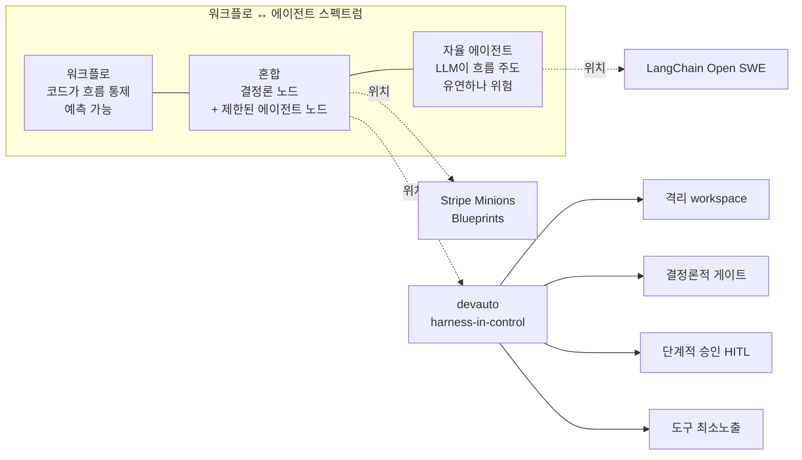

# 02. 에이전틱 코딩 아키텍처

업계 프로덕션 사례와 설계 패턴을 조사해, devauto의 harness-in-control 설계가 타당한지, 무엇을 차용할 수 있는지 확인합니다. 출발점은 사용자가 참조한 [agentic-workflows](https://github.com/kimchanhyung98/agentic-workflows) 저장소의 프로덕션 사례 분석입니다.

## 1. 핵심 구분: 워크플로 vs 에이전트

Anthropic의 "Building Effective Agents"는 에이전틱 시스템을 두 가지로 구분합니다.

- 워크플로: LLM·도구를 사전 정의된 코드 경로로 오케스트레이션. 예측 가능.
- 에이전트: LLM이 자기 프로세스·도구 사용을 동적으로 주도. 유연하나 비용·오류 누적 위험.

처방은 명확합니다. "단순하게 시작하고 모든 것을 측정하라. 예측 가능한 작업에는 워크플로를, 개방형·유연한 판단이 필요할 때만 에이전트를 도입하라." devauto는 LLM 호출 코드를 두지 않고 외부 CLI에 위임하며 결정론적 오케스트레이터가 흐름을 통제하므로, 이 처방을 강하게 따르는 구현입니다.

대표 워크플로 패턴(devauto 관련 항목):

- Prompt chaining: 작업을 순차 단계로 분해, 단계 사이에 프로그래밍적 체크포인트(게이트). devauto의 계획 → 실행 → 게이트 → 리뷰 흐름과 대응.
- Evaluator-optimizer: 한 LLM이 생성, 다른 평가자가 피드백을 반복. devauto의 "결정론적 게이트로 검증 후 bounded fix 루프"와 대응.
- Orchestrator-workers: 중앙이 작업을 분해해 위임·종합. 역할 분리(planner/executor/reviewer)의 일반형.

## 2. 프로덕션 사례 분석

검증 기준: Stripe·Anthropic·LangChain/Open SWE처럼 원문 확인이 가능한 자료는 현재 공개 문서를 우선했습니다. Coinbase/Pinterest 사례는 공식/엔지니어링 블로그와 사용자가 제공한 `agentic-workflows` 요약을 함께 보되, 세부 내부 수치·도구 개수·조직 운영 방식은 "패턴 참고"로 해석합니다.

### 2.1 Stripe Minions

원샷 E2E 코딩 에이전트로, 주당 1,000건 이상의 PR을 자동 생성합니다(코드 작성은 에이전트, 리뷰는 사람). Block의 오픈소스 Goose를 포크해 무인 운영에 맞췄고, Anthropic이 정의한 워크플로(결정론)와 에이전트(자율)를 "Blueprints"라는 상태머신으로 결합한 것이 핵심입니다.

6레이어 구조:

- Devbox(격리): AWS EC2 기반 일회용 환경. "cattle, not pets"로 표준화·즉시 폐기. QA 환경에서 실행되며 프로덕션 데이터·서비스·임의 외부 네트워크 접근이 차단돼 blast radius를 단일 Devbox로 한정.
- 에이전트 하네스: Goose 포크. 격리로 위험 반경이 제한되므로 confirmation·중단을 제거하고 샌드박스 내 전권 부여.
- Blueprints(오케스트레이션): 결정론 노드("Run configured linters")와 에이전트 노드("Implement task")를 섞은 상태머신.
- 컨텍스트 수집: rule 파일을 파일시스템 경로·패턴 기반으로 자동 첨부(전역 무조건 주입 회피).
- MCP Toolshed: 약 400~500개 내부 도구. 파괴적 동작 차단 통제, 태스크별 부분집합만 노출.
- 검증 게이트: push 전 lint, 최대 2회 CI 반복 사이클(자동 수정). 자동 게이트 통과 후 사람이 최종 리뷰.

devauto와의 관계: harness-in-control, 격리 workspace, 결정론적 게이트(lint/CI), 큐레이션된 도구 노출, 워크플로+에이전트 혼합이 거의 일치합니다. 차이는 Minions가 "무인 자율 실행 후 PR 리뷰만 사람"인 반면, devauto는 계획승인·발행승인 등 단계적 승인을 실행 도중에 두고 더 보수적인 출력을 기본으로 한다는 점입니다.

### 2.2 Coinbase Cloudbot (현 Forge)

Slack 네이티브 백그라운드 코딩 에이전트로, 두 엔지니어가 시작해 1,000명 이상으로 확장됐습니다. 특정 모델에 묶이지 않은 멀티모델 설계가 특징입니다.

- 호출: Slack 스레드에서 태그해 호출, Linear 티켓과 연동.
- 컨텍스트: Skills + MCP로 Datadog, Sentry, Snowflake 등 사내 관측·데이터 도구에 연결.
- 모드: Plan 모드(코딩 전 계획 생성), Explain 모드(디버깅·조사). 계획을 먼저 산출해 사람이 검토.
- 출력: PR에 Cursor 딥링크·모바일 테스트 QR을 포함해 채팅을 떠나지 않고 리뷰·머지.
- 승인: 리스크 기반. 저위험 변경은 최소 리뷰로 출하.

devauto와의 관계: "계획을 먼저 만들고 사람이 검토", "외부 관측을 MCP로 주입", "채팅 UI에서 승인" 흐름이 devauto의 요청 → 계획승인 → 미리보기 → 발행승인과 통합니다. 차이는 Forge가 Slack 협업·리스크 기반 경량 승인을 지향하는 반면, devauto는 비개발자 전용 웹 UI와 명시적 다단계 게이트, 로컬 우선 격리를 더 강하게 강제한다는 점입니다.

### 2.3 LangChain Open SWE

LangGraph + Deep Agents 기반 오픈소스(MIT) 비동기 자율 SWE 에이전트로, Stripe·Coinbase·Ramp가 사내에서 만든 coding agent 패턴을 공개 프레임워크로 일반화하려는 프로젝트입니다. 현재 공개 README 기준 핵심은 다음입니다.

- Agent harness: LangGraph와 Deep Agents 위에 구성되며, org별 도구·middleware·system prompt를 바꿀 수 있습니다.
- 샌드박스: 각 task가 독립 cloud sandbox에서 실행되고, Modal·Daytona·Runloop·LangSmith 등 provider를 교체할 수 있습니다. thread별 persistent sandbox, task별 병렬 sandbox를 지원합니다.
- 도구 큐레이션: shell, git/GitHub 작업, Slack/Linear 응답, Deep Agents의 파일·검색·subagent 도구를 노출합니다. Datadog/LangSmith 같은 관측 도구는 server-side credential로 제한 노출하며, prompt injection을 residual risk로 명시합니다.
- 컨텍스트: `AGENTS.md`와 issue/thread context를 주입합니다.
- invocation: Slack, Linear, GitHub 코멘트에서 호출합니다.
- validation: agent가 lint/format/test를 실행하도록 지시받지만, 공개 README는 이를 "prompt-driven validation"으로 설명합니다. devauto처럼 하네스가 gate 순서와 차단 권한을 직접 소유하는 구조는 아닙니다.
- 출력: commit/push/draft PR 생성과 원 채널 응답까지 agent가 담당합니다.

devauto와의 관계: 격리 sandbox, `AGENTS.md`/context 주입, 도구 큐레이션, Slack/Linear/GitHub 같은 협업 표면, PR까지 이어지는 비동기 실행 패턴은 참고 가치가 큽니다. 차이는 Open SWE가 agent가 commit/push/PR까지 주도하는 자율 모델이고, 검증도 prompt-driven 성격이 강하다는 점입니다. devauto는 비개발자 QA를 위해 계획승인·검증 gate·발행승인을 하네스가 직접 소유해야 하므로 Open SWE보다 보수적인 통제 모델을 유지해야 합니다.

### 2.4 Pinterest MCP 생태계

도메인별로 분리된 내부 MCP 서버들을 중앙 레지스트리로 연결한 프로덕션 생태계입니다. 도구 거버넌스 모델로서 참고 가치가 있습니다.

- 중앙 레지스트리: 어떤 서버가 존재하고 누가 소유하며 어떻게 연결하는지의 단일 진실 원천. 단순 목록이 아니라 거버넌스 중추.
- 2층 보안: end-user JWT(사람 접근 제어) + 서비스 흐름의 메시 아이덴티티. 민감 서버는 비즈니스 그룹 기반 접근 게이팅으로 최소 권한·감사성 확보.
- 거버넌스 게이트: 모든 MCP 서버는 소유 팀 지정·레지스트리 등재·보안/프라이버시 리뷰 통과가 필수.

devauto와의 관계: 도구를 중앙에서 큐레이션·게이팅하고 최소 권한·감사성을 강제하는 사상이 devauto의 "도구는 통제된 인터페이스로만 노출" 원칙과 일치합니다. devauto는 로컬 단일 하네스라 거버넌스 무게는 가볍지만, 장차 도구 노출 정책·감사 로그를 설계할 때 참고할 모델입니다.

## 3. Human-in-the-loop 설계 패턴

HITL은 에이전트의 도구 호출에 사람 감독을 끼워 넣는 패턴입니다. 모델이 검토가 필요한 동작(파일 쓰기, 명령 실행)을 제안하면 실행을 일시정지하고 사람의 결정을 기다립니다(LangGraph의 interrupt/resume이 대표 구현).

- 결정 유형: approve(승인), edit(실행 전 수정), reject(피드백과 함께 거부), respond(질문형 도구에 직접 응답).
- 전략적 게이팅: 모든 단계가 아니라 비가역·고-blast-radius 동작(접근 승인, 설정 변경, 파괴적 동작)에만 인터럽트.
- 상태 영속화: 인터럽트 시 상태를 동결해 안전하게 일시정지·후속 재개.
- 운영 항목: 동일 작업의 순차 다중 인터럽트 처리, 일정 시간(예: 24h) 내 재개되지 않은 버려진 인터럽트의 TTL 만료·정리.

devauto와의 관계: 계획승인·발행승인 게이트, 미리보기(중간 산출물 검토), 보수적 출력이 "비가역 동작에만 게이팅 + approve/edit/reject" 패턴과 일치합니다. devauto는 결정론적 오케스트레이터 코드로 인터럽트/재개 상태를 직접 관리한다는 점이 다릅니다. 버려진 승인 요청의 TTL 만료, 다중 승인 처리, "수정 후 재개"의 1급 지원은 차용 후보입니다(추정).

## 4. devauto에 주는 시사점

- 워크플로 우선 설계는 업계 합의와 일치한다. Stripe Blueprints와 Anthropic 가이드 모두 자율 에이전트보다 결정론적 워크플로를 권하므로, harness-in-control·외부 CLI 위임 방향은 정당하다.
- 격리는 통제 완화의 전제다. Stripe는 Devbox로, Open SWE는 Daytona로 blast radius를 가둬 내부 단계의 마찰을 줄인다. devauto도 격리 workspace를 강하게 유지할수록 자동 단계를 매끄럽게 만들 명분이 생긴다.
- 검증은 결정론적 게이트 + 자동 수정 루프로 표준화한다. Minions의 lint/CI 반복은 참고할 수 있지만, Open SWE의 현재 공개 설계는 prompt-driven validation에 가깝다. devauto는 AI 지시가 아니라 하네스가 gate 실행 순서와 실패 판정을 소유해야 한다.
- 도구 노출은 큐레이션·최소권한·게이팅. Stripe Toolshed와 Pinterest 2층 인가를 참고해, 태스크별로 한정 노출하고 감사 로그를 남긴다.
- 인터럽트는 비가역·고위험 동작에만 둔다. 발행·파괴적 변경에만 승인 게이트를 두고 그 외는 결정론적 게이트로 자동 통과시켜 비개발자 QA의 피로를 줄인다.
- 승인 결정 모델을 approve/edit/reject(+respond)로 명시화한다. 미리보기에서 "수정 후 재개"를 1급 경로로 지원하면 비개발자의 통제력이 커진다.
- 계획을 먼저 산출해 사람이 검토하는 흐름은 공통 표준이다. devauto의 "요청 → 계획승인"을 핵심 게이트로 유지하되, 계획 산출물을 비개발자가 이해할 형태(요약·미리보기)로 제시한다.

## 출처

- Stripe Minions: <https://stripe.dev/blog/minions-stripes-one-shot-end-to-end-coding-agents>, <https://stripe.dev/blog/minions-stripes-one-shot-end-to-end-coding-agents-part-2>
- Coinbase Forge/Cloudbot: <https://rywalker.com/research/in-house-coding-agents>
- LangChain Open SWE: <https://github.com/langchain-ai/open-swe>, <https://blog.langchain.com/open-swe/>, <https://deepwiki.com/langchain-ai/open-swe>
- Pinterest MCP: <https://www.infoq.com/news/2026/04/pinterest-mcp-ecosystem/>
- Anthropic Building Effective Agents: <https://www.anthropic.com/research/building-effective-agents>
- HITL 패턴: <https://docs.langchain.com/oss/python/langchain/human-in-the-loop>, <https://www.langchain.com/blog/making-it-easier-to-build-human-in-the-loop-agents-with-interrupt>
