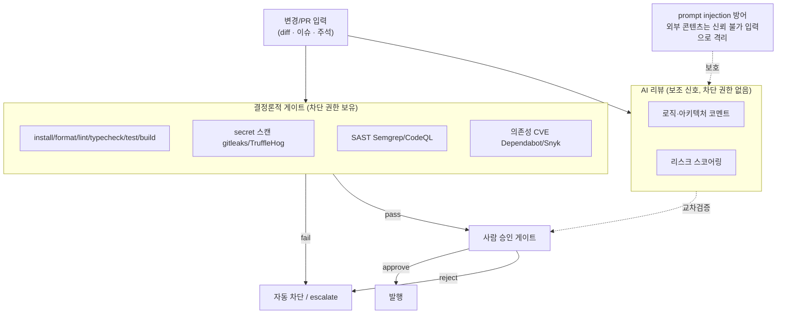

# 03. PR 검증과 보안

사용자가 추가로 원하는 "PR 검증 로직(보안·취약점 검증 포함)" 용도를 어떻게 설계할지 조사합니다. 핵심 결론은 "AI 판단은 게이트가 아니라 보조 신호로 두고, 결정론적 보안 게이트를 별도로 강제하며, prompt injection을 방어한다"입니다.

## 1. 출발점: devauto의 기존 검증

devauto는 이미 다음을 갖추고 있습니다. 이 위에 보안 검증을 얹는 것이 과제입니다.

- 결정론적 게이트를 하네스가 직접 실행(install → format → lint → typecheck → test → build).
- AI reviewer가 `DECISION: pass/fix/escalate`를 산출. `fix`는 bounded feedback으로 executor 재실행, `escalate`는 failure report.
- secret redaction(artifact 저장 전), hard-deny 명령 차단(push·deploy·sudo·SSH 등), sanitized env, 격리 workspace.

## 2. AI 코드리뷰·보안 도구 비교

조사 기준일 2026-06. 검출률·정확도 다수는 벤더 자체 벤치마크나 2차 집계이며, 절대치보다 상대 경향으로 해석해야 합니다. PR gate 설계에는 "AI 리뷰 도구 A가 몇 %를 잡는다"가 아니라 "AI 리뷰는 놓침과 오탐이 모두 있으므로 차단 권한을 주지 않는다"는 원칙만 반영합니다.

| 도구 | 분류 | 주요 검출 대상 | 강점 / 한계 |
|------|------|----------------|-------------|
| CodeRabbit | AI PR 리뷰 | 로직 결함, 스타일, PR 요약 | 노이즈 억제 지향 / 벤더·2차 벤치마크상 놓침 가능 |
| Greptile | AI PR 리뷰(코드베이스 컨텍스트) | 로직 버그, 크로스파일 영향 | 더 많이 잡는 방향 / 벤더 벤치마크상 FP 증가 가능 |
| Cursor BugBot | AI PR 리뷰 | 버그, 취약점, CVE, null 참조 | Autofix·학습 규칙 / 스타일은 미대상 |
| GitHub Copilot code review | AI PR 리뷰 | 국소 로직, 스타일 | 네이티브·무료 / 시스템 패턴 미평가 |
| Qodo | AI 리뷰 + 테스트 생성 | 크로스레포 버그, 리스크 스코어링 | 멀티레포 이해 / 설정 복잡 |
| Graphite Diamond | AI PR 리뷰 | 고신뢰 이슈만 선별 | 고신뢰 코멘트 지향 / 놓침 가능 |
| Snyk Code(DeepCode AI) | SAST + AI 수정 | 데이터플로 기반 취약점 | 전문가 수정 DB로 보강·자동수정 PR |
| Semgrep(+Assistant) | SAST + AI 트리아지 | 패턴 취약점 + FP 필터링 | FP 분류 정확·노이즈 억제·학습 메모리 |
| GitHub CodeQL | SAST(semantic) | 데이터플로 취약점 | GitHub 보안 워크플로와 자연스럽게 통합 / 학습곡선 |
| Dependabot / Snyk OSS | SCA(의존성) | 알려진 CVE 의존성 | 자동 패치 PR / 알려진 CVE에 한정 |
| Socket | 공급망 행동 분석 | 악성 패키지, 의심 install 스크립트 | 알려진 CVE 너머 악성 행위 지향 |
| gitleaks | Secret 스캐닝 | 하드코딩 시크릿(정규식) | 매우 빠름(diff 1초 미만), 게이트용 |
| TruffleHog | Secret 스캐닝 + 검증 | 700+ 시크릿 유형, live 검증 | 활성 자격증명 확인 / 전체 히스토리 스캔 느림 |

핵심 패턴(설계에 직접 영향): 검출률과 FP는 트레이드오프입니다. 많이 잡는 도구는 노이즈가 늘고, 고신뢰 코멘트만 내는 도구는 놓침이 늘어납니다. 그래서 단일 AI 판단을 머지 게이트로 쓰면 어느 쪽이든 위험합니다.

## 3. AI 생성 코드의 보안 리스크

devauto는 "AI가 만든 코드를 AI가 리뷰"하는 구조가 되기 쉬우므로, AI 코드의 체계적 취약 경향을 알아야 합니다.

- Veracode 2025 GenAI Code Security Report: 100개 이상 LLM × 80개 과제에서 AI 생성 코드의 약 45%가 보안 취약점을 도입한다고 보고. 모델이 커져도 기능적 정확성 개선이 보안성 개선을 보장하지 않는다는 점이 핵심입니다.
- 시크릿 노출: AI 보조 커밋이 인간 전용 커밋 대비 약 2배 비율로 시크릿을 노출한다는 2차 집계. 탐지 후에도 상당수가 활성 상태로 방치.
- 반복 생성에서의 보안 저하: AI에 코드를 반복 수정시킬수록 취약점이 누적된다는 분석(arXiv 2506.11022). devauto의 fix 루프가 반복 패치를 시도하는 구조라면 직접 관련된 리스크다.
- vibe coding 앱: 5개 도구로 만든 15개 앱에서 CSRF 보호 부재·보안 헤더 미설정·SSRF가 공통 발견. 이런 클래스는 결정론적 룰로 잡기 쉬운 영역이다.

함의: 결정론적 보안 게이트(SAST + secret 스캔 + 의존성 검사)를 AI 판단과 별도로 강제해야 합니다.

## 4. 에이전트·LLM 보안 위협

devauto가 PR diff·이슈·코드 주석을 LLM 컨텍스트에 넣는 순간 직접적인 공격면이 생깁니다.

- OWASP Top 10 for LLM 2025: LLM01 Prompt Injection(2연속 1위), LLM02 민감정보 노출, LLM05 부적절한 출력 처리, LLM06 과도한 권한(Excessive Agency) 등.
- 직접 vs 간접 인젝션: 간접 인젝션은 모델이 처리하는 외부 콘텐츠(README, 코드 주석, PR 설명, 이슈 본문)에 숨은 지시를 심는 방식.
- 실제 사고 — CVE-2025-53773(CVSS 9.6): GitHub Copilot/VS Code가 이슈·PR·주석의 페이로드를 처리하며 `.vscode/settings.json`에 자동 승인("YOLO 모드")을 써넣어 사용자 확인 없이 셸 명령을 실행(RCE)한 사례. 에이전트가 승인 없이 파일을 디스크에 직접 쓸 수 있었던 점이 근본 원인. devauto의 hard-deny 명령 차단과 직접 대응되는 위협 모델.
- OWASP Top 10 for Agentic Applications 2026(2025-12 발표): ASI01 Agent Goal Hijack, ASI02 Tool Misuse, ASI03 Privilege Abuse, ASI05 Unexpected Code Execution, ASI06 Memory/Context Poisoning 등. LLM Top 10보다 "도구를 가진 자율 에이전트"의 권한·목표·메모리 오염에 초점을 둡니다.
- 자동 머지 위험: PR 본문·diff 자체가 간접 인젝션 벡터이므로, 에이전트 PR을 사람 승인 없이 자동 머지하면 인젝션 → 권한 오용 → 코드 실행으로 연쇄될 수 있다. 자동 머지 금지 + 사람 승인 게이트가 표준 완화책.

## 5. AI 리뷰의 한계 (왜 사람 승인이 여전히 필요한가)

- 비즈니스 로직: 기술적으로 맞고 테스트를 통과해도 "요구사항에 맞는가"는 도메인 지식이 필요해 AI가 판단하기 어렵다(할인 계산식, 권한 검사 엣지케이스, 데이터 불변식).
- 아키텍처: 올바른 추상화인지, 기존 로직 중복인지, 결합도 문제를 만드는지 등 diff 너머 판단은 AI가 약하다.
- 논리적 보안 결함: 인가 우회, IDOR, 타이밍 공격 같은 "의도된 기능의 악용"은 패턴 매칭형 도구가 자주 놓친다.
- 자동화율 권고: GitHub responsible use 문서는 Copilot code review를 사람 리뷰의 대체가 아니라 보조 도구로 쓰라고 권고하고, cloud agent 결과도 병합 전 테스트·보안 검증·사람 검토를 요구합니다. "AI green light"가 사람 리뷰어의 경계를 느슨하게 만드는 역효과도 주의해야 합니다.

## 6. devauto에 적용 가능한 PR 검증 설계

결정론적 게이트 + AI 리뷰 + 보안 스캐너를 계층화합니다. AI 판단은 게이트가 아니라 보조 신호입니다.

- 결정론적 보안 게이트를 기존 게이트와 동급의 required check로 추가한다: secret 스캔(gitleaks를 PR diff에 빠르게), 의존성 CVE 스캔(Dependabot/Snyk OSS), SAST(Semgrep 또는 CodeQL). GitHub Copilot cloud agent도 생성 코드에 보안 검증을 적용하는 방향을 문서화하고 있으며, devauto는 이를 로컬 하네스 gate로 옮긴다. fail 시 자동 차단.
- secret 스캐닝 2단 구성: 커밋·PR diff는 gitleaks(빠른 차단), 전체 히스토리·live 검증은 TruffleHog verified mode를 스케줄로. 기존 redaction(로그 노출 방지)과 역할이 다르다(코드 진입 차단).
- AI reviewer의 `DECISION`은 머지/발행 권한이 아니라 코멘트·리스크 신호로 한정한다. 보안 관련 발견은 결정론적 스캐너 결과와 교차검증한다. 검출률↔FP 트레이드오프상 단일 AI 판단을 게이트로 쓰면 위험하다.
- FP 억제 계층을 둔다. Semgrep Assistant식 노이즈 필터와 triage memories처럼, 룰별 과거 판정·프로젝트 컨텍스트를 누적해 반복 FP를 줄인다.
- 간접 프롬프트 인젝션 방어를 reviewer 입력 단계에 내장한다. PR 설명·이슈 본문·코드 주석은 신뢰 불가 입력으로 취급하고, LLM 컨텍스트에 넣을 때 데이터/지시 경계를 명시한다. 모델 출력이 시스템 설정 변경·명령 실행·자동 승인 토글을 지시해도 무시하도록 설계한다(CVE-2025-53773 교훈).
- 에이전트 권한 최소화와 hard-deny 확장. 기존 hard-deny를 보안 스캐너 우회·설정 파일(`.vscode/settings.json`, CI 설정, hook) 자동 수정 차단까지 확장한다. fix 단계가 보안·승인·자동실행 설정 파일을 건드리면 escalate한다. CVE-2025-53773의 핵심 교훈은 "에이전트가 자신의 승인/도구 실행 환경을 바꿀 수 있으면 권한 상승이 된다"는 점입니다.
- 자동 머지 금지, escalate → 사람 승인 경로 강제. 보안 영향 변경은 사람 승인 없이 발행 불가. 비즈니스 로직·논리적 인가 결함은 AI가 못 잡으므로 크리티컬 경로는 사람 검토가 필수다.
- 반복 fix 루프에 보안 회귀 검사를 삽입한다. 반복 생성 시 취약점 누적 경향이 있으므로, fix 루프의 각 사이클 끝에 SAST·secret 스캔을 재실행하고 신규 보안 발견 시 루프 중단·escalate한다.

## 7. devauto 설계와의 적합성

devauto의 기존 구조는 이 권고와 잘 맞습니다. hard-deny 차단은 CVE-2025-53773 유형 위협의 완화책이고, "AI는 commit/push 권한 없음, 발행은 사람 승인"은 자동 머지 금지 권고와 일치하며, bounded fix 루프는 보안 회귀 검사를 삽입하기 좋은 지점입니다. 추가로 필요한 것은 결정론적 보안 스캐너(secret/SAST/SCA)를 게이트로 편입하고, reviewer 입력의 인젝션 경계를 명시하는 일입니다.

## 출처

- AI 코드리뷰 벤치마크: <https://www.greptile.com/benchmarks>
- GitHub Copilot responsible use: <https://docs.github.com/en/copilot/responsible-use/agents>
- GitHub Copilot cloud agent: <https://docs.github.com/en/copilot/concepts/agents/cloud-agent/about-cloud-agent>
- Veracode 2025 GenAI Code Security Report: <https://www.veracode.com/blog/genai-code-security-report/>
- OWASP Top 10 for LLM 2025: <https://owasp.org/www-project-top-10-for-large-language-model-applications/>, <https://genai.owasp.org/llmrisk/llm01-prompt-injection/>
- OWASP Top 10 for Agentic Applications 2026: <https://genai.owasp.org/2025/12/09/owasp-top-10-for-agentic-applications-the-benchmark-for-agentic-security-in-the-age-of-autonomous-ai/>
- CVE-2025-53773(Copilot RCE via prompt injection): <https://embracethered.com/blog/posts/2025/github-copilot-remote-code-execution-via-prompt-injection/>
- Semgrep Assistant 노이즈 필터: <https://semgrep.dev/blog/2025/announcing-ai-noise-filtering-and-triage-memories/>
- Snyk DeepCode AI: <https://snyk.io/platform/deepcode-ai/>
- Secret 스캐너 비교: <https://devsecops.ae/secrets-scanners-comparison-2026/>
- 반복 AI 생성 보안 저하 연구: <https://arxiv.org/pdf/2506.11022>
- AI 리뷰 한계: <https://www.aviator.co/blog/ai-code-review-is-still-a-review/>
