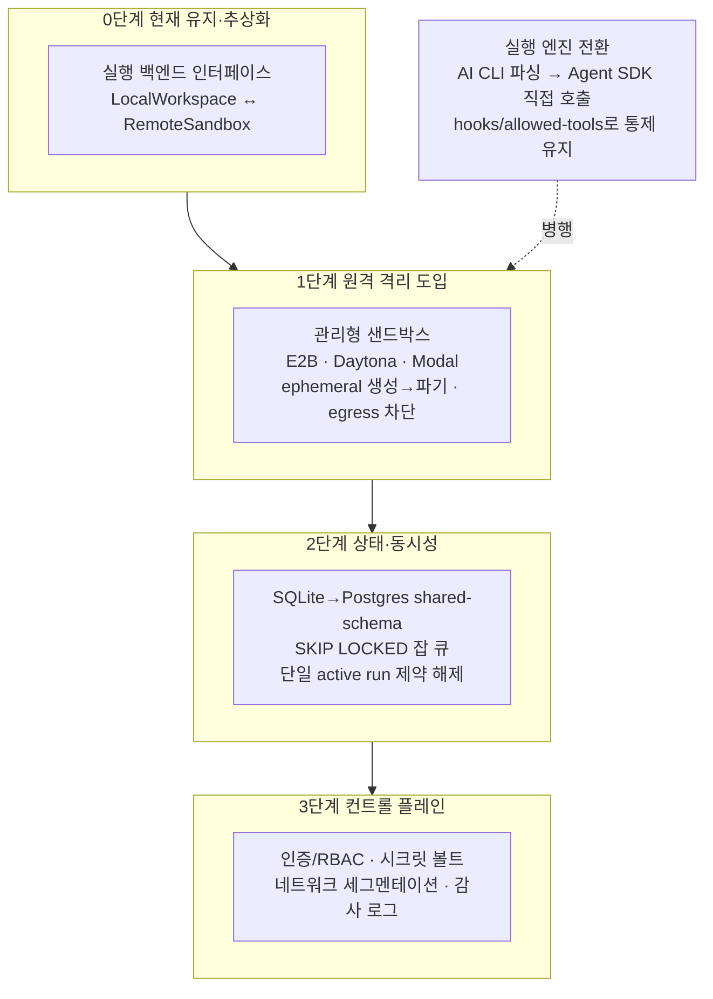

# 04. 클라우드 진화 아키텍처

"로컬 하네스 → 클라우드 AI Debug product" 진화 경로의 기술적 실현성을 조사합니다. 핵심은 격리(sandboxing), 멀티테넌시, 실행 엔진(CLI → API) 전환입니다.

## 1. 격리 기술 비교

AI 에이전트는 사람 검토 없이 임의 코드를 생성·실행하므로, 멀티테넌트 환경에서는 컨테이너 단독으로 부족합니다.

| 기술 | 격리 수준 | 시작 속도 | 보안 강도 | 적합 용도 |
|------|-----------|-----------|-----------|-----------|
| Docker 컨테이너 | 프로세스 격리(커널 공유) | 수 ms | 낮음 — 커널 취약점 시 탈출 가능 | 검증·신뢰된 코드만 |
| gVisor | syscall 가로채기, 커널 공격면 축소 | 수 ms, I/O 부하 시 오버헤드 | 중간 | 멀티테넌트 컴퓨트(Modal, GKE Agent Sandbox) |
| Firecracker microVM | 하드웨어(KVM) 격리, 전용 커널 | ~125ms, VM당 <5MiB | 높음 — 적대적 워크로드 표준 | 신뢰 불가 에이전트 코드(E2B, Vercel Sandbox) |
| Kata Containers | VMM 하드웨어 격리를 컨테이너 API로 | ~200ms(추정) | 높음 | 규제 산업, 멀티테넌트 K8s |
| V8 Isolate / Wasm | 언어 런타임 수준 격리 | 수 ms | 중간 — OS 미제공 | 짧은 ephemeral 코드(파일시스템 불필요) |
| Confidential Computing(TEE) | 하드웨어 암호화 메모리 | 추가 부팅 비용 | 최고 — 호스트 운영자도 차단 | 최고 민감도 데이터·컴플라이언스 |

관리형 샌드박스 콜드스타트 수치(Daytona, E2B, Modal 등)는 벤더/2차 벤치마크마다 다르므로 제품 설계의 절대 기준으로 쓰지 않습니다. 트레이드오프 요약: 컨테이너는 빠르지만 탈출 위험이 있어 신뢰 불가 AI 에이전트 단독 실행엔 약하고, Firecracker/Kata는 전용 커널로 강한 격리를 주지만 네트워킹·이미지 배포·데이터 이동 비용을 직접 풀어야 합니다.

## 2. 클라우드 코딩 에이전트의 격리 실태

상용 제품들이 공개한 격리 방식입니다. 공통 패턴은 devauto의 run별 격리 workspace 모델과 같은 방향입니다.

- Devin(Cognition): 상태 없는 추론 서비스("Brain")와 코드 실행용 격리 VM("Devbox")을 분리. 세션마다 독립 VM, 멀티테넌트에서 세션별 머신 격리. 엔터프라이즈는 단일 테넌트 VPC 전용 배포.
- OpenAI Codex cloud/CLI: 공식 문서는 sandboxing, approvals, network controls를 핵심 보안 경계로 설명합니다. setup/agent 단계의 네트워크 통제, 승인 정책, 파일·명령 접근 제한을 운영 정책으로 다룹니다. devauto는 Codex를 사용하더라도 "AI가 통제권을 갖는다"가 아니라 하네스가 sandbox/approval policy를 고정하는 방식이어야 합니다.
- GitHub Copilot cloud agent: GitHub Actions 기반 ephemeral development environment에서 repository를 research/plan/code하고 branch에 변경을 만듭니다. 공식 문서 기준 사람이 diff를 검토하고 PR을 생성/검토하는 흐름이며, 한 세션 59분 제한, 한 작업당 한 branch/PR 제한이 있습니다. responsible use 문서는 사람 검토·테스트·보안 검증을 요구합니다.
- Google Jules: 저장소를 격리된 GCP VM에 clone, 작업 후 VM 파기. 빌드·테스트용 네트워크 허용, Environment Snapshot으로 재실행 가속. 기반 GKE Agent Sandbox는 gVisor로 pod 단위 격리.

공통 패턴: 작업·세션마다 ephemeral 격리 환경을 생성·파기, 기본 네트워크 차단/허용목록, 사람 리뷰·브랜치 격리, 생성 코드 보안 스캔 또는 별도 보안 검증.

## 3. 로컬 → 클라우드 진화 시 핵심 과제

- 컴퓨트 테넌트 격리: 단일 머신의 sanitized child env는 멀티테넌트에서 커널 공유가 위험하다. run마다 microVM(Firecracker/Kata) 또는 gVisor 전용 격리가 필요하다. API 토큰·env를 다루는 에이전트는 강한 격리가 전제다.
- 상태 저장소 SQLite → Postgres: SQLite 단일 라이터는 동시 쓰기에서 락 병목. 멀티테넌트는 shared-schema(모든 테이블에 `tenant_id`)가 무난하고, schema-per-tenant는 수백 테넌트 이상에서 마이그레이션·커넥션 풀 부담.
- 작업 큐·오케스트레이션: 단일 active run을 동시 멀티테넌트로. Postgres `SKIP LOCKED` 기반 큐(크래시 시 자동 unclaim)로 시작하고, 내구성·재시도·타임아웃 요구가 늘면 Temporal 같은 durable orchestration을 고려.
- 백그라운드 작업의 테넌트 누수: 잡이 record ID만 들고 기본 컨텍스트로 돌면 격리가 깨진다. 모든 잡 페이로드가 `tenant_id`를 강제로 요구하도록 감사한다.
- 인증/RBAC·비밀관리: 작업마다 단명·최소권한 토큰 발급, 빌드 이미지에 시크릿을 굽지 말고 런타임 주입. 테넌트별 시크릿 볼트, 감사 로그.
- 네트워크 egress 통제: 기본 전체 차단 → 필요한 API만 허용, DNS 해석 제한으로 데이터 유출 방지, 에이전트 네트워크를 프로덕션·데이터스토어와 분리.
- 비용·동시성·콜드스타트: 워밍 풀, 지연 이미지 로딩(SOCI/eStargz), active-CPU 과금, 환경 스냅샷 재사용. 실행당 GB 단위 데이터 이동(data gravity)이 원격 샌드박스를 비싸게 만든다.

## 4. AI API vs AI CLI (harness-in-control 유지)

클라우드에서 CLI 대신 API로 직접 호출할 때도 통제권을 유지하는 방법입니다.

- Claude Agent SDK는 Claude Code와 같은 에이전트 루프(컨텍스트 수집 → 도구 호출 → 결과 반영 → 반복)를 프로그래밍 인터페이스로 노출한다. 시스템 프롬프트·허용 도구·hooks·권한 모드를 호출 단위로 통제할 수 있다. "누가 루프를 운전하는가"가 CLI(사람) vs SDK(애플리케이션)의 차이다.
- harness-in-control 유지(추정 포함): CLI 출력 파싱 의존을 SDK로 바꾸면, devauto의 게이트를 SDK hooks(도구 실행 전 승인)로, sanitized env를 per-query allowed-tools/permission으로 매핑할 수 있다. 에이전트 루프를 호스트가 아니라 샌드박스 내부에서 돌리고, 도구·네트워크 권한을 하네스가 선언적으로 강제하면 API 직접 호출에서도 통제권을 유지한다.
- OpenAI 쪽에서 현재 공식적으로 확인한 핵심은 Codex의 sandbox/approval/network control 모델입니다. Daytona·E2B·Modal·Cloudflare·Vercel 같은 sandbox provider 비교는 OpenAI 공식 지원 목록이 아니라 외부 실행 백엔드 후보로 별도 평가해야 합니다. 하네스가 실행 백엔드를 교체 가능한 플러그인으로 두는 패턴은 유효하지만, 특정 provider 지원 여부는 실제 SDK/벤더 문서로 매번 재확인해야 합니다.
- OpenHands(MIT)는 append-only 이벤트 스트림을 단일 진실 원천으로 두고 Docker 컨테이너 런타임에서 에이전트 액션을 실행한다. security analyzer를 포함해 참고할 만한 오픈 아키텍처다.

## 5. devauto AI Debug product 아키텍처 제언

단계적 진화 경로입니다. 한 번에 재작성하지 않고 추상화부터 시작합니다.

- 0단계(현재 유지·추상화): 실행 백엔드를 인터페이스로 추상화한다(`LocalWorkspace` ↔ `RemoteSandbox`). 현재의 run별 격리 workspace + run branch + sanitized env 모델을 계약으로 굳혀, 이후 원격 구현을 끼워넣을 수 있게 한다.
- 1단계(원격 격리 도입): 직접 Firecracker 오케스트레이션을 짜지 말고 관리형 샌드박스(E2B·Daytona·Modal 또는 Cloudflare/Vercel Sandbox)부터 채택한다. run마다 ephemeral 샌드박스 생성→파기, 기본 차단 egress + 허용목록, 런타임 시크릿 주입. 적대적·신뢰 불가 코드 비중이 커지면 Firecracker/Kata 자가호스팅으로 내려간다(추정: 볼륨이 정당화될 때).
- 2단계(상태·동시성): SQLite는 로컬 모드 유지, 클라우드는 Postgres shared-schema + `SKIP LOCKED` 잡 큐로 단일 active run 제약을 해제한다. 모든 잡 페이로드에 `tenant_id`를 강제한다. 장기 워크플로가 늘면 Temporal 등 durable orchestration을 도입한다.
- 3단계(컨트롤 플레인): 인증/RBAC, 테넌트별 시크릿 볼트, 네트워크 세그멘테이션, 감사 로그를 갖춘 멀티테넌트 제어면을 추가한다. 컴퓨트(샌드박스)와 데이터 격리를 분리해 설계한다.
- 실행 엔진 전환: AI CLI 파싱 의존을 Claude/OpenAI 계열 SDK·API 직접 호출로 교체하더라도, 하네스가 allowed tools, hooks, approval/permission policy, network policy를 선언적으로 통제해야 한다. 에이전트 루프는 샌드박스 내부에서 실행해 호스트 노출을 막는다.
- 보안 게이트(상용 패턴 차용): Codex/Copilot 패턴 — sandbox/approval policy, 네트워크 옵트인 또는 허용목록, 전용 브랜치 격리, 사람 리뷰 게이트, 생성 diff에 CodeQL·secret scan·dependency scan.
- 성능·비용: 워밍 샌드박스 풀 + 지연 이미지 로딩 + 환경 스냅샷 재사용(Jules·Cloudflare 모델) + active-CPU 과금으로 콜드스타트·동시성 비용을 최적화한다.

핵심 원칙: devauto의 정체성(harness-in-control, 비개발자 가드레일, 단계적 승인)을 클라우드로 옮길 때도 유지하는 것입니다. 실행 환경만 로컬에서 원격 격리로 바뀌고, 통제·검증·승인 레이어는 그대로 남아야 합니다.

## 출처

- AI 에이전트 샌드박싱: <https://northflank.com/blog/how-to-sandbox-ai-agents>, <https://www.softwareseni.com/firecracker-gvisor-containers-and-webassembly-comparing-isolation-technologies-for-ai-agents/>, <https://manveerc.substack.com/p/ai-agent-sandboxing-guide>
- 관리형 샌드박스 비교: <https://northflank.com/blog/daytona-vs-e2b-ai-code-execution-sandboxes>, <https://particula.tech/blog/modal-vs-e2b-vs-daytona-vs-vercel-sandbox-ai-code-execution>
- Devin 아키텍처: <https://docs.devin.ai/enterprise/deployment/overview>
- OpenAI Codex 보안: <https://developers.openai.com/codex/agent-approvals-security>
- GitHub Copilot cloud agent: <https://docs.github.com/en/copilot/concepts/agents/cloud-agent/about-cloud-agent>, <https://docs.github.com/en/copilot/responsible-use/agents>
- Google Jules / GKE Agent Sandbox: <https://blog.google/innovation-and-ai/models-and-research/google-labs/jules/>, <https://docs.cloud.google.com/kubernetes-engine/docs/how-to/agent-sandbox>
- Postgres 멀티테넌시: <https://clickhouse.com/resources/engineering/multi-tenant-saas-postgres-architecture>, <https://planetscale.com/blog/approaches-to-tenancy-in-postgres>
- Claude Agent SDK: <https://code.claude.com/docs/en/agent-sdk/overview>
- OpenHands: <https://docs.openhands.dev/openhands/usage/architecture/runtime>
