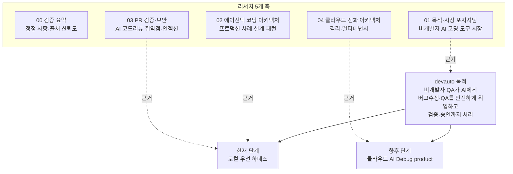

# devauto 리서치 모음

이 디렉터리는 devauto 프로젝트의 "기획·리서치 공백"을 메우기 위한 조사 자료입니다. 저장소는 명확한 기획 없이 동작 초안(harness)이 먼저 구현된 상태였으므로, 이 리서치는 제품 의도를 **외부 근거(업계 프로덕션 사례, 도구 시장, 보안 연구)로 검증**하고, 현재(로컬 하네스)와 향후(클라우드 AI Debug product) 방향을 구체화합니다. 구현 순서는 [`docs/report.md`](../report.md)에 정리했습니다.

## 1. 이 리서치가 답하려는 질문

- devauto가 풀려는 문제(비개발자가 AI로 코드를 안전하게 수정)는 실제 시장에서 비어 있는가, 아니면 이미 풀렸는가.
- devauto의 설계(하네스 통제, 격리, 결정론적 게이트, 단계적 승인)는 업계 프로덕션 사례와 비교해 타당한가.
- 사용자가 추가로 원하는 "PR 검증·보안/취약점 검증" 용도는 어떻게 설계해야 하는가.
- "로컬 하네스 → 클라우드 AI Debug product" 진화 경로는 기술적으로 실현 가능한가.

## 2. 확인된 구체적 목적

리서치를 종합하면 devauto의 목적은 다음과 같이 구체화됩니다.

현재 단계는 **"개발자가 한 번 세팅해 두면, 비개발자 QA 팀원이 브라우저만으로 AI에게 버그수정·QA 초안을 맡기고, 하네스가 그 결과를 검증·통제하며, 사람이 단계적으로 승인하는 로컬 우선 도구"**입니다. AI(외부 CLI)는 자율 주체가 아니라 결정론적 오케스트레이터가 통제하는 역할별 도구입니다.

향후 단계는 같은 통제·검증·승인 모델을 유지한 채 실행 환경을 클라우드의 격리된 컨테이너로 옮기고, AI CLI 대신 AI API(Agent SDK)를 호출하며, 단일 사용자에서 멀티테넌트로 확장하는 **AI Debug product**입니다.

핵심 통찰(기획과 리서치가 함께 지지): AI 코딩 자동화의 병목은 "AI가 코드를 고칠 수 있는가"가 아니라 **"그 결과를 사람이 안전하게 신뢰하고, 비개발자까지 참여시킬 수 있는가"**입니다.

## 3. 핵심 결론 요약

- 시장 공백은 실재한다(추정 포함). 비개발자용 AI 빌더(Lovable, v0, Bolt, Replit, GitHub Spark)는 full-stack 생성·배포까지 확장되고 있지만 여전히 주된 흐름은 클라우드 기반 신규 앱 생성이다. 자율 SWE 에이전트(Devin, Jules, Codex, Copilot cloud agent)는 기존 코드 수정과 PR까지 다루지만 개발자 검토를 전제한다. 로컬 우선 에이전트(Cline, Aider)는 개발자 CLI/IDE 사용자 대상이다. "로컬 우선 + 비개발자 셀프서비스 + 기존 코드베이스 버그수정/QA + 하네스 통제"를 동시에 충족하는 제품은 확인되지 않았다. 자세한 내용은 [01 문서](./01-purpose-and-market-positioning.md).
- 설계 방향은 업계 합의와 대체로 일치한다. Stripe Minions의 Blueprints(결정론 노드 + 제한된 에이전트 노드), Anthropic의 "워크플로 우선" 처방, Open SWE의 격리 sandbox·도구 큐레이션·PR 자동화 패턴이 devauto의 harness-in-control과 맞닿아 있다. 단, Open SWE는 현재 prompt-driven validation과 자동 PR 생성을 강조하므로 devauto보다 자율성이 높고 gate 책임이 약하다. 자세한 내용은 [02 문서](./02-agentic-coding-architecture.md).
- PR 검증·보안 용도는 가능하되 계층 설계가 필요하다. AI 리뷰는 게이트가 아니라 보조 신호로 두고, 결정론적 보안 게이트(SAST, secret 스캔, 의존성 검사)를 별도로 강제하며, prompt injection(특히 PR/이슈/주석을 통한 간접 인젝션)을 방어해야 한다. 자세한 내용은 [03 문서](./03-pr-validation-and-security.md).
- 클라우드 진화 경로는 선례가 충분하다. Devin·Codex·Jules·Copilot cloud agent 모두 작업·세션 단위의 격리 환경, 네트워크 통제, 사람 리뷰/승인을 핵심 안전장치로 둔다. devauto의 run별 격리 workspace 모델은 이 방향과 동형이며, 실행 백엔드 추상화부터 시작하면 점진적 이전이 가능하다. 자세한 내용은 [04 문서](./04-cloud-evolution-architecture.md).

## 4. 문서 안내

| 문서 | 내용 | 주로 답하는 질문 |
|------|------|------------------|
| [00 검증 요약](./00-verification-summary.md) | 정정 사항, 출처 신뢰도, 검증 결론 | 기존 리서치의 오류와 불확실성은 무엇인가 |
| [01 목적과 시장 포지셔닝](./01-purpose-and-market-positioning.md) | 비개발자 AI 코딩 도구 시장, vibe coding 위험, devauto 차별점 | 누구를 위한, 어떤 빈 자리인가 |
| [02 에이전틱 코딩 아키텍처](./02-agentic-coding-architecture.md) | Stripe·Coinbase·Open SWE·Pinterest 사례, Anthropic 패턴, HITL | 설계가 타당한가, 무엇을 차용할까 |
| [03 PR 검증과 보안](./03-pr-validation-and-security.md) | AI 코드리뷰 도구, AI 코드 보안 리스크, OWASP·인젝션, 검증 설계 | PR 검증·보안 용도를 어떻게 만들까 |
| [04 클라우드 진화 아키텍처](./04-cloud-evolution-architecture.md) | 격리 기술, 클라우드 에이전트 실태, 멀티테넌시, 진화 로드맵 | 클라우드 제품으로 어떻게 키울까 |

## 5. 방법과 한계

- 방법: 사용자 문제 정의와 초기 하네스 방향을 기준으로, 4개 주제를 웹 리서치하고 출처와 함께 정리했다. 사용자가 참조한 [agentic-workflows](https://github.com/kimchanhyung98/agentic-workflows) 저장소의 프로덕션 사례(Stripe Minions, Coinbase Cloudbot, LangChain Open SWE, Pinterest)를 출발점으로 삼되, 개별 사실은 공식 문서·벤더 원문·공개 GitHub README·보안 연구 자료로 재검증했다.
- 한계: AI 코딩 도구·벤더 사양은 빠르게 변한다. 검출률·정확도·콜드스타트 같은 수치 다수는 벤더 자체 벤치마크나 2차 집계이며 본문에 출처와 함께 표기했다. 코드에 직접 근거가 없는 시장·전략 해석은 "추정"으로 표시했다. 자동화 검증 중 일부 동적 페이지는 HTML이 크거나 bot challenge가 있어 공식 Markdown/API/원문 링크를 우선 사용했다.
- 기준 시점: 2026-06-27.
